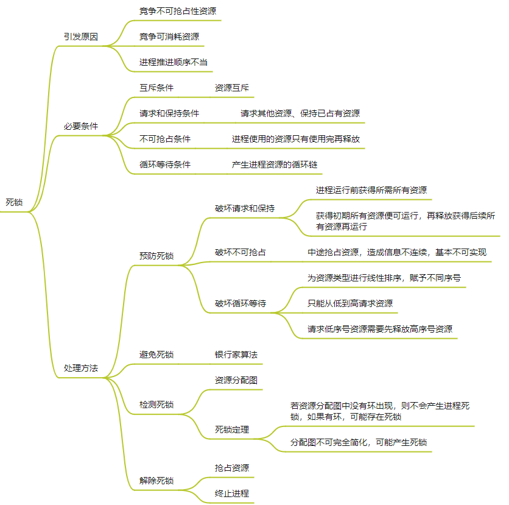
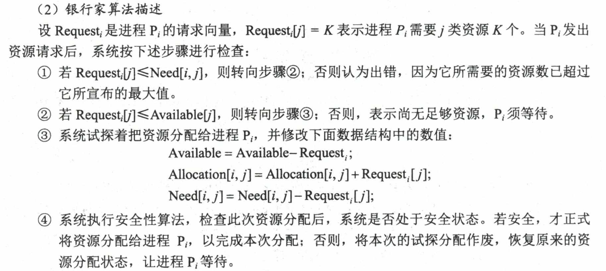
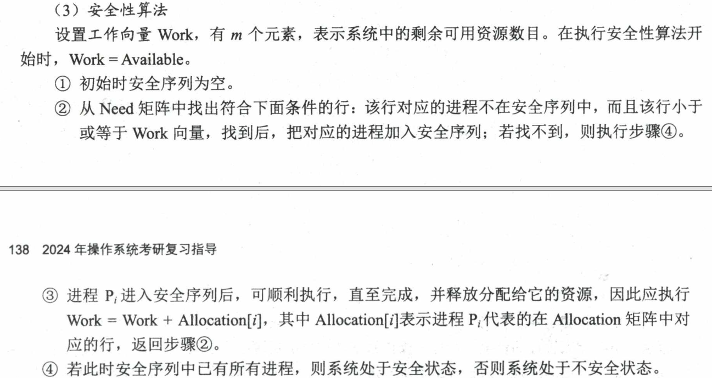

# BaoYan复习

# 线性代数

常见问题：

1. 线性空间（向量空间）。
2. 矩阵的秩。
3. 特征值和特征向量。
4. 相似矩阵。
5. 正定矩阵。
6. 线性相关、线性无关。
7. 矩阵的正交。

## 1 行列式

概念：

- 代数余子式（有正负号）、余子式

具体实现：

- 行列式求解
- 克拉默法则

线性方程组的 $|D| \neq 0$ ，则有唯一解 $x_1 = \frac{|D_1|}{|D|}, ..., x_n = \frac{|D_n|}{|D|}$  

## 2 矩阵

### 2.1 概念

- 方阵、对称矩阵、伴随矩阵

伴随矩阵： $A_{ij}$ 为 $a_{ij}$ 的代数余子式，伴随矩阵为
$$
A^{*} = 
\begin{bmatrix}
A_{11} & \cdots & A_{1n} \\
\vdots & \ddots & \vdots \\
A_{n1} & \cdots & A_{nn}
\end{bmatrix}
$$


- 矩阵变化

行变换：相当于左乘矩阵

列变化：相当于右乘矩阵

- 逆矩阵、非退化矩阵（n阶方阵、行列式为0）

逆矩阵：
$$
A^{-1} = \frac{1}{|A|} A^{*}
$$
矩阵可逆的等价条件：

1.  存在 `n` 阶矩阵 $B$ 使得 $AB = BA = E$ 
2.  $|A| \neq 0$ 
3.  $A$ 的行列向量组线性无关
4.  $A$ 是满秩矩阵
5.  齐次线性方程组 $AX = 0$ 只有零解
6.  $A$ 可以写成一系列初等矩阵的乘积
7.  $\lambda _i \neq 0$ 
8.  $A$ 的标准型是单位矩阵

- 矩阵的等价

$A$ 可以通过一系列初等变换变为 $B$ 矩阵
$$
P_s \cdots P_1AQ_1 \cdots Q_t = B
$$


### 2.2 具体实现

- 矩阵方程求解 $AX = B$ 

1. 直接由增广矩阵求出答案

$$
(A, B) \rightarrow (E, A^{-1} B) \\
X = A^{-1}B
$$

2. 先用初等变换法求逆矩阵 $A^{-1}$，然后用逆矩阵求答案

$$
X = BA^{-1}
$$


- 矩阵乘法、乘法运算规则
- 逆矩阵求解方法

1. 行初等变换法： $(A, E) \rightarrow (E, A^{-1})$ 或者列初等变换
2. 待定系数法，设一个矩阵，然后解方程
3. 定义法：使用定义式求解伴随矩阵，进而求出逆矩阵（计算量很大）

## 3 线性方程组

### 3.1 概念

- 增广矩阵 $(A, B)$ 
- 自由未知量（不贡献秩的列），固定未知量（贡献秩的列）
- 线性相关，线性无关，线性表出

线性表出：存在一组数 $k_1, \cdots, k_s$ ，使得 $\beta = k_1 \alpha_1 + \cdots + k_s \alpha_s$ ，称 $\beta$ 可由向量组 $\alpha_1, \cdots, \alpha_s$ 线性表出

线性相关： $\alpha _i$ 可由其他向量线性表出

线性无关：不存在向量可以被其他向量线性表出

- 向量组的秩、矩阵的秩

向量组的秩：最大线性无关组所含的向量个数

矩阵的秩：矩阵行（列）向量组的秩

- 基

$P^n$ 中任意 $n$ 个线性无关的向量组成的向量组称为 $P^n$ 中的一个基。

### 3.2 具体实现

- 求矩阵的秩

将矩阵通过初等变换化为标准形（阶梯型矩阵） 

- 线性方程组的求解判定
  - 有解判定定理，唯一解 $r(A) = r(A,B) = n$ ，无穷解 $r(A) = r(A,B) \lt n$ 
  - 无解判定 $r(A) \neq r(A,B)$ 
- 解结构
  - 基础解系（自由未知量，非单位1的列，个数为 $n - r(A)$ ）
  
  > 特征向量：自由未知量的系数向量
  
  - 特解（常数向量，不带自由未知量）

## 4 特征值

### 4.1 概念

- 特征值、特征向量、特征矩阵、特征多项式

存在一个 $\lambda$ 使得 $AX = \lambda X$ ，$\lambda$ 是 $A$ 的一个特征值， $X$ 是属于 $\lambda$ 的一个特征向量，$X$ 是 $n$ 维非零列向量

上式可以转化为 $(\lambda E - A) X = 0$ 

$\lambda E - A$ 为 $A$ 的特征矩阵，行列式 $|\lambda E - A|$ 为 $A$ 的特征多项式， $|\lambda E - A| = 0$ 为 $A$ 的特征方程

- 矩阵的迹

矩阵 $A$ 有多个特征值，则 $|A| = \lambda_1 \lambda_2 \cdots \lambda_n$ 

迹为主对角元素之和， $trA = \lambda_1 + \cdots + \lambda_n$ 

- 矩阵的相似

存在可逆矩阵 $P$ 使得 $P^{-1}AP = B$ ，则 $A$ 和 $B$ 相似

> 性质：
>
> 1. 相似矩阵具有相同的特征值
> 2. 相似矩阵行列式相等
> 3. 相似矩阵具有相同的迹

- 正交向量组、正交基、正交矩阵

正交向量组：向量组中的向量两两正交，正交向量组必是线性无关的，向量之间的内积为0

正交基：向量组是一个基，且是正交的

正交矩阵： $A^{'} A = E$ ，则 $A$ 为正交矩阵，等价于 $A$ 的列向量组是一个单位正交向量组

### 4.2 具体实现

- 求 $A$ 特征值和特征向量

1.  $|\lambda E - A| = 0$ 求得 $A$ 的特征根 $\lambda _i$
2. 特征根带入 $|\lambda E - A| = 0$ ，求得基础解系，所有的特征向量就是基础解系乘一个非零常数 $k$ 

- 例题：对矩阵 $A$ ， 求可逆矩阵 $C$ ，使 $C^{-1}AC$ 为对角阵

1.  $|\lambda E - A| = 0$ 求得 $A$ 的特征根
2. 特征根带入 $|\lambda E - A| = 0$ ，求得特征向量（列向量）
3.  $C$ 矩阵就是所有列特征向量的组合
4. 对角阵就是对应特征值的对角阵

- 将线性无关向量组转化为（单位）正交向量组


- 求正交矩阵 $T$ ，使 $T^{-1}AT$ 为对角矩阵

1. 根据 $|\lambda E - A| = 0$ 带入特征值求得基础解系
2. 进行施密特正交化方法，求得正交向量，然后再单位化求得单位向量
3. 单位向量组合起来就是正交矩阵 $T$ ，对角元素为对应的特征值

## 5 二次型

### 5.1 概念

- 二次型，标准二次型，二次型矩阵

$f(x_1, x_2, \cdots, x_n)$ 为 $n$ 元二次型，只含有平方项的二次型为标准二次型
$$
f = (x_1, \cdots, x_n)
\begin{bmatrix}
a_{11} & \cdots & a_{1n} \\
\vdots & \ddots & \vdots \\
a_{n1} & \cdots & a_{nn}
\end{bmatrix}
\begin{bmatrix}
x_1 \\
\vdots \\
x_n
\end{bmatrix}
= X ^ {'} A X
$$
矩阵 $A$ 为二次型矩阵

> 任何 $f(X) = X^TAX$ 都可以通过正交替换 $X = TY$ 化为标准型

- 二次型的秩： $A$ 的秩就为二次型的秩
- 正交替换（$\mathbf{X = CY}$，$\mathbf{C}$为正交矩阵）
- 矩阵的合同（$P^TAP$）

存在 `n` 阶可逆矩阵使 $B = C^{T}AC$ ，则称 $A$ 与 $B$ 合同

- 正定二次型

$$
\forall X \in R^n, f(X) > 0
$$

此时 $A$ 为正定矩阵

- 正定矩阵：$\forall \mathbf{X} \in R^n \hspace{1em} f(\mathbf{X}) > 0$ 为正定二次型， $A$ 矩阵为正定矩阵

>  $f(X) = X^TAX$ 正定的条件：
>
> -  $f$ 的正惯性系数为 $n$ 
> - 存在可逆矩阵 $D$ 使 $A = D^TD$ 
> -  $A$ 的特征值 $\lambda_i \geq 0$ 
> -  $A$ 的全部顺序主子式均大于0

- 半正定矩阵： $\forall \mathbf{X} \in R^n \hspace{1em} f(\mathbf{X}) \geq 0$ 为半正定二次型， $A$ 矩阵为半正定矩阵

> 负定： 小于0，半负定：小于等于0

- 正负惯性系数
- 顺序主子式

$D_1$ 为 左上角 1 阶方阵， $D_2$ 为左上角 2 阶方阵，...，$D_n$ 为左上角 n 阶方阵

### 5.2 具体实现

- 实二次型化为标准型

1. 二次型矩阵通过特征方程求特征向量
2. 特征向量正交，再单位化
3. 得到的列向量组合起来为正交矩阵 $T$ 
4. 线性替换 $X = TY$ 为正交替换，则 $f = X^TAX = Y^T (T^T A T)Y = Y^T C Y$ ， $C$ 为对应的特征值对角矩阵

## 6 线性空间

概念：

- 线性空间：由向量组成的集合，满足加法封闭性和数乘封闭性。同时满足加法交换律，加法结合律，零元素，负元素，标量乘法结合律和标量乘法分配律


<div STYLE="page-break-after: always;"></div>

# 概率论

常见问题：

1. 大数定理。
2. 中心极限定理。
3. 全概率公式和贝叶斯公式。
4. 正态分布（高斯分布）。
5. 概率密度函数。

 

## 1 概率

- 古典概型和几何概型
  - 古典概型（有限等可能）
  - 几何概型（无限等可能）
- 条件概率

$$
P(A|B) = \frac{P(AB)}{P(B)}
$$

- 全概率公式

$$
P(B) = \sum \limits_{i = 1}^n P(A_i)P(B|A_i)
$$

- 贝叶斯公式：根据先验概率计算后验概率

$$
P(H|E) = \frac{P(H)P(E|H)}{P(E)} \\
P(B_i | A) = \frac{P(B_i)P(A|B_i)}{\sum_i P(B_i) P(A|B_i)} \\
P(H_i | E_1E_2 \cdots E_m) = \frac{P(E_1|H_i)P(E_2|H_i) \cdots P(E_m|H_i)P(H_i)}{\sum \limits_{j = 1}^n P(E_1|H_j)P(E_2|H_j) \cdots P(E_m|H_j)P(H_j)}
$$

- 先验概率和后验概率
  - 先验概率：事情未发生，根据以往数据分析得到的概率
  - 后验概率：事情已发生，这件事情发生的原因是由某个因素引起的概率。 $P(B_i|A)$ 中 $B_i$ 为某个因素，$A$ 为已经发生的结果

## 2 离散随机变量及分布

$X$ 的概率分布函数：

- 两点分布（01分布）$X \thicksim B(1, p)$

$$
P(X = 0) = 1 - p \\
P(X = 1) = p \\
p \in (0,1)
$$

- 二项分布（伯努利分布）$X \thicksim B(n, p)$

$$
P(X = k) = C_n^k p^k (1 - p)^{n - k} \hspace{1em} p \in (0,1), k = 0,1,2,\cdots, n
$$

- 泊松分布 $X \thicksim P(\lambda)$

$$
P(X = k) = \frac{\lambda ^ k e ^{- \lambda}}{k!} \hspace{1em} \lambda \gt 0, k = 0,1,2,\cdots
$$

- 几何分布 $X \thicksim G(p)$

$$
P(X = k) = (1 - p) ^ {k - 1} p \hspace{1em} p \in (0, 1), k = 1, 2, \cdots
$$

- 超几何分布 $X \thicksim h(n, N, M)$

$N$个产品，$M$个次品，从中无放回随机抽取$n$个，不合格数$X$服从超几何分布
$$
P(X = k) = \frac{C_{N - M} ^ {n - k}C_M^k}{C_N ^ n}
$$

联合分布函数：二维随机变量 $(X, Y)$ 的分布函数。

边缘概率函数：从联合分布函数得到只关于一个变量的概率分布，而不再考虑另一变量的影响，相当于降维操作

条件概率函数：在一个已知变量发生的情况下，考虑另一个变量的概率分布函数

## 3 连续随机变量及分布

概率密度函数：连续型随机变量 $X$ 的分布函数为 $F(x)$ ，若存在一个非负的函数 $f(x)$ ，使得对任意 $x$ 有：
$$
F(x) = \int _{-\infin} ^x f(t) dt
$$
则称 $f(x)$ 为 $X$ 的概率密度函数

联合概率密度：二维随机变量的概率密度函数

边缘分布函数：二维随机变量关于某一维变量的概率密度分布，化为关于这一维变量的积分函数

- 均匀分布 $X \thicksim U(a, b)$

$$
f(x) = 
\begin{cases}
\frac{1}{b - a}, & a \le x \le b \\
0, &其他
\end{cases}
$$

- 指数分布 $X \thicksim E(\lambda)$

$$
f(x) = 
\begin{cases}
\lambda e ^{-\lambda x}, & x \gt 0 \\
0, &其他
\end{cases}
$$

- 正态分布（高斯分布）$X \thicksim N(\mu, \sigma ^ 2)$

$$
f(x) = \frac{1}{\sqrt{2 \pi} \sigma} \huge{e} ^ {\Large{- \frac{(x - \mu) ^ 2}{2 \sigma ^ 2}}}
$$

标准正态分布 $X \thicksim N(0, 1)$

## 4 随机变量数字特征

- 数学期望

离散分布的数学期望：

1. 两点分布 $p$

2. 二项分布 $np$

3. 泊松分布 $\lambda$

4. 几何分布 $\frac{1}{p}$

连续分布的数学期望：
$$
E(X) = \int _{-\infin}^{+ \infin} xf(x) dx
$$

1. 均匀分布 $\frac{a + b}{2}$
2. 指数分布 $\frac{1}{\lambda}$
3. 正态分布 $\mu$

- 方差

$$
D(X) = E[(X - E(X))^2] = E(X^2) - E^2(X)
$$


- 协方差

$$
Cov(X, Y) = E[(X - E[X])(Y - E[Y])] = E[XY] - E[X]E[Y]
$$

从数值来看，协方差的数值越大，两个变量同向程度也就越大。反之亦然。

- 相关系数

$$
\rho_{_{XY}} = \frac{Cov(X, Y)}{\sqrt{D(X)} \sqrt{D(Y)}}
$$

相关系数等于0，不相关，相互独立

- 独立、互斥、相关（线性相关）

## 5 大数定理和中心极限定理

- 大数定理

样本数量很大的时候，样本均值和数学期望充分接近，也就是说当我们大量重复某一相同的实验的时候，其最后的实验结果可能会稳定在某一数值附近。

伯努利大数定律： $f_n(A)$ 为事件 $A$ 出现的频率，$p$ 是事件A每次实验中发生的概率
$$
\mathop{lim} \limits _{n \rightarrow \infin} P \{ |f_n(A) - p| \lt \varepsilon \} = 1
$$
还有切比雪夫大数定律，马尔科夫大数定律

- 中心极限定理

大量（$n \to \infin$）、独立、同分布的随机变量之和，近似服从于一维正态分布。

随机变量之和的标准化变量为
$$
\eta = \frac{\sum \limits _{i = 1} ^{n} x_i - n \mu}{\sqrt{n} \sigma}
$$


均值为$\mu$，方差为$\sigma^2$的独立同分布的随机变量序列$x_1, x_2, \cdots, x_n$，只要$n$足够大，就有
$$
\frac{\sum \limits _{i = 1} ^{n} x_i - n \mu}{\sqrt{n} \sigma} \stackrel{近似}{\thicksim} N(0, 1)
$$

## 6 参数估计

极大似然估计要求所有采样都是独立同分布的

**就是利用已知的样本结果信息，反推最具有可能（最大概率）导致这些样本结果出现的模型参数值！**

求最大似然估计量 $\hat \theta$ 步骤：

1. 写出似然函数，似然函数越大越好

$$
L = \prod \limits _{i = 1} ^n f(x_i)
$$

2. 对似然函数取对数，整理

3. 求导数，让导数等于0

4. 解似然方程

<div STYLE="page-break-after: always;"></div>

# 高数

- 函数；单射，满射，双射；

- 连续，间断；可导，可微
- 极值点，最值点，凹凸性，凸函数，拐点
- 中值定理：四个中值定理的区别

常见问题：

1. 可导、可微、连续、可积之间的关系（一元函数+二元函数）。
2. 三个中值定理的区别、联系和物理意义（罗尔、拉格朗日、柯西）。
3. 梯度、方向导数与梯度下降。
4. 泰勒公式。

## 1 可导可微可积连续

- 对于一元函数，可导可微等价
- 可导一定连续，连续不一定可导（绝对值函数，连续但不可导）

## 2 中值定理

- 罗尔定理

$f(x)$ 在 $[a, b]$ 内连续，在 $(a, b)$ 内可导， $f(a) = f(b)$ ，则存在 $\xi \in (a, b)$ ，使得 $f{'}(\xi) = 0$ 

物理意义：$s-t$ 图像，从起点回到原点，中间必有速度为0的点

- 拉格朗日中值定理

$f(x)$在$[a, b]$内连续，在$(a, b)$内可导，则存在$\xi \in (a, b)$，使得$f{'}(\xi) = \frac{f(b) - f(a)}{b - a}$ 

如果 $f(a) = f(b)$ ，就是罗尔定理

物理意义： $s - t$ 图像，从a到b点，中间必有速度为 $\frac{f(b) - f(a)}{b - a}$ 的点

- 柯西中值定理

$f(x),g(x)$在$[a, b]$内连续，在$(a, b)$内可导，且满足$g'(x) \neq 0 (a \lt x \lt b)$，则存在$\xi \in (a, b)$，使得$\frac{f'(\xi)}{g'(\xi)} = \frac{f(b) - f(a)}{g(b) - g(a)}$ 

当 $g'(x) = 1, g(b) - g(a) = b - a$ 就是拉格朗日中值定理，故拉格朗日又是柯西的特例

物理意义：在二维空间运动下，$x = g(t),y=f(t)$ ，从a到b，存在速度朝向所在直线的斜率等于ab所在直线的斜率


- 泰勒中值定理

泰勒公式：
$$
e^x = 1 + x + \frac{x ^ 2}{2!} + \frac{x^3}{3!} + \cdots + \frac{x^n}{n!} + o(x^n)
$$
$o(x^n)$ 为佩亚诺型余项

泰勒中值定理是拉格朗日中值定理的推广
$$
f(x) = f(x_0) + f'(x_0) (x - x_0) + \frac{f''(x_0)}{2!} (x - x_0) ^ 2 + \cdots + \frac{f^{(n)}(x_0)}{n !} (x - x_0) ^ n + R_n(x)
$$


## 3 梯度和方向导数

函数 $f(x, y)$ 沿任意方向 $l$ 的方向导数：
$$
对于f(x, y)在P(x_0, y_0)可微分，\frac{\partial f}{\partial l} \Bigg \vert _{(x_0, y_0)} = f_x(x_0, y_0) cos \alpha + f_y(x_0, y_0)cos \beta = (f_x(x_0, y_0), f_y(x_0, y_0)) \cdot (cos\alpha, cos\beta)
$$
当偏导向量和方向向量同向时，方向导数最大，那么把这个方向向量就叫做**函数在该点的梯度**。

梯度是使得方向导数变化最大的**方向向量**，使函数值增长最快的方向。

>  以三元函数为例， $u = f(x, y, z) $ 在 $P_0$ 的梯度为： $grad \ u(P_0) = \{ f_x(P_0), f_y(P_0), f_z(P_0) \}$
>
>  梯度下降一般是沿着梯度相反的方向

## 4 凹凸函数和琴生不等式

凸函数：
$$
f(\frac{x_1 + x_2}{2}) > \frac{f(x_1) + f(x_2)}{2}
$$
凹函数：
$$
f(\frac{x_1 + x_2}{2}) < \frac{f(x_1) + f(x_2)}{2}
$$

## 5 偏导偏微全微

- 偏导

对于某一自变量的增量，对应有相应函数的增量，如果某自变量增量趋近于0时，极限存在，即为偏导数。
$$
\frac{\partial z}{\partial x} = \frac{\partial z}{\partial u} \frac{\partial u}{\partial x} + \frac{\partial z}{\partial v} \frac{\partial v}{\partial x}
$$

- 全微分

$$
对于 u= f(x, y, z) \hspace{1em}du = \frac{\partial u}{\partial x} dx +  \frac{\partial u}{\partial y} dy + \frac{\partial u}{\partial z} dz
$$

相互关系：

偏导函数连续一定可微， $\partial z / \partial x$ 等连续

可微（可导）一定连续，可微一定偏导函数存在，可微一定沿任何方向导数均存在

连续一定有极限

## 6 无穷级数

收敛：如果级数 $\sum \limits _{n = 1} ^ {\infin} u_n$ 的部分和数列 $\{ s_n \}$ 有极限 $s$ ，即 $\mathop{lim} \limits _{n \rightarrow \infin} = s$ ，则称无穷级数 $\sum \limits _{n = 1} ^ {\infin} u_n$ 收敛

发散：如果没有收敛，则称无穷级数 $\sum \limits _{n = 1} ^ {\infin} u_n$ 发散

绝对收敛： $\sum \limits _{n = 1} ^ {\infin} |u_n|$ 收敛，则称级数 $\sum \limits _{n = 1} ^ {\infin} u_n$ 绝对收敛

条件收敛： $\sum \limits _{n = 1} ^ {\infin} |u_n|$ 发散，则称级数 $\sum \limits _{n = 1} ^ {\infin} u_n$ 条件收敛  

调和级数 $1 + 1/2 + 1/3 + \cdots + 1/n$发散，上限函数 $ln(x) + C$

几何级数 $1 + 1/2 + 1/4 + \cdots + 1/2^n$ 收敛

<div STYLE="page-break-after: always;"></div>

# 离散数学

常见问题：

1. 集合论

2. 平面图

## 1 集合论

概念：

- 集合中，关系的自反性（均有环）、反自反性（均无环）、对称性（无向图）、反对称性（类似有向图，两点之间只有一条边）、传递性
- 闭包：传递闭包即通过传递关系由关系 $R$ 导出又一个关系 $R^{'}$ ，这个调用传递的关系就是原关系的传递闭包（类似一个工具箱，是功能的扩充）
- 次序关系：偏序$\le$（自反、反对称、传递）和拟序$\lt$（反自反，传递）
- 等价关系：若满足自反、对称、传递性，即为等价关系
- 函数，单射，满射，双射

## 2 代数系统

概念：

- 单位元、逆元素、零元素
- 同构、同态
- 群（结合律，存在单位元素，逆元素）环格

## 3 图论

概念：

- 完全图（边数等于$n(n-1)/2$），子图（点为子集且边为子集），补图（两图的边之并等于完全图的边，且两图的边之交为空），零图，平凡图，简单图（没有多重边）
- 通路，回路（起点与终点相同），连通图（任意两个点都连通）：强连通（有向图任意两点互相可达），弱连通（有向图去除方向任意两点均可达），单向连通（至少有一向是可达的）
- m元树，生成树，最小生成树（prim算法和kruskal算法）
- 欧拉图（一条回路经过每条边一次，具有该回路的图是欧拉图）：每个节点均具有偶次数；$i,j$ 存在欧拉回路的充要条件：$i,j$ 的次数均为奇数，其余为偶数

定理：

- 所有点的度数之和必为偶数

## 4 数理逻辑

- 命题连接词：否定，合取，析取，蕴含，等价
- 命题逻辑公式（命题公式）：由命题联结词连接的命题
- 范式：析取范式，合取范式，对命题逻辑公式的连接
- 谓词逻辑；引入个体函数，谓词等概念，如存在，任意等

> 谓词逻辑对原子命题进一步分解，将命题逻辑表达不出来的逻辑进一步细化。命题逻辑是谓词逻辑的基础，谓词逻辑是命题逻辑的细化。

<div STYLE="page-break-after: always;"></div>

# 计算机网络

## 1 应用层

### 1.1 HTTP(TCP)

浏览器访问WWW服务器过程：首先进行域名解析，然后通过TCP向服务器发送连接请求

**HTTP本身是无连接**，无状态的。无状态特性使服务器能够支持大量的并发HTTP请求。实际应用中，通常使用Cookie加数据库跟踪用户活动。

> Cookie原理：用户访问使用Cookie的网站，服务器生成一个唯一识别码，在响应报文中添加Set-cookie首部行，用户收到后，在本机特定文件中记录主机名和cookie。当用户再次浏览时，用户会取出对应cookie放入请求报文的首部行。

持续连接：分为流水线方式和非流水线方式，默认采用流水线方式，共经历1个RTT延迟

非持续连接：每个网页对象都需要建立一个TCP连接

HTTP面向文本的，报文中每个字段都是ASCII字符串

### 1.2 SMTP/POP3(TCP)

推协议：SMTP（端口号25，TCP连接）、HTTP

拉协议：POP3（TCP）、IMAP、HTTP

### 1.3 DNS(UDP)

根域名服务器-顶级域名服务器-权限域名服务器-本地域名服务器

域名解析方式：

- 递归解析

- 迭代解析

本地域名服务器一般会保存查询结果的缓存，待下次再次查询时，可直接返回查询结果。

### 1.4 FTP(TCP)

工作方式：客户机/服务器，TCP可靠传输服务

服务器进程组成：（主进程和从属进程并发执行）

- 主进程：负责接受新的请求
- 若干从进程：负责处理单个请求

使用两个并行的TCP连接：控制连接（21端口号）和数据连接（20端口号）

控制连接：用来传输控制信息（连接请求、传送请求等）

数据连接：客户端和服务端的数据传输

### 1.5 网络应用模型

客户机/服务器模型：

- 服务器可以通过权限访问控制客户机的活动

- 客户机之间不直接通信

- 可扩展性不强，服务器支持的客户机数量有限

P2P模型：

- 减轻计算压力
- 可扩展性好
- 网络健壮性强

但是影响本机的速度，占用本机的内存

## 2 运输层

套接字：唯一标识网络中的一台主机和其中的一个应用，相当于IP+端口号

TCP：面向连接的可靠传输服务

UDP：无连接非可靠传输协议，仅提供两个服务（多路复用和对数据的错误检查）

### 2.1 UDP

分组首部`8B` ，UDP支持一对一，一对多，多对多的通信

地址标识：（目的主机IP + 进程端口号）

特点：

1. 无连接
2. 无拥塞控制
3. 不可靠，数据可靠通过应用层实现

> 但有校验和，检测出错后，报告应用层（或者丢弃），运输层不改动

### 2.2 TCP

首部为`20B`

地址标识：（源主机IP + 源端口号 + 目的主机IP + 目的端口号）

面向连接的可靠传输协议：

- 面向连接：三握四挥
- 可靠传输：差错检测，确认重传，定时器管理
- 流量控制：滑动窗口
- 拥塞控制：慢开始，拥塞避免，快重传，快恢复

---

三次握手：

1. TCP请求报文段
2. TCP连接响应报文段
3. TCP连接确认（附带应用层请求报文）
4. 应用层响应报文进行响应

> 为什么不是两次握手：在某些情况下（网络延迟，数据丢失），服务器连接响应报文可能无法到达客户端，导致连接无法建立

四次挥手：

1. 客户（客户端和服务端都可以主动提出）主动提出释放连接请求
2. 服务端进行响应确认，通知应用进程关闭服务线程
3. 服务端关闭线程后，发送关闭连接的确认响应
4. 客户端接受到关闭通知后，发送确认响应

> 三次挥手可能出现的问题：
>
> - 出现半开连接，客户端发送关闭连接请求，并且收到服务器的ack确认响应，于是关闭连接，但是服务器没有检测到连接已经关闭，导致服务器资源一直被占用
> - 客户端和服务端都以为连接已经关闭，实际上没有关闭，这种情况称为死链接，占用网络资源

---

**可靠传输：**

> TCP头部包含：校验和，序号和确认号，超时计数器
>
> 序号：占 4B ，每个字节都要编一个号，序号字段的值为本报文段发送数据的第一个字节的序号。
>
> 确认号：期望对方下一个报文段接受到的字节序号，若确认号为N，代表序号到N-1为止的数据全部收到。

每发送一个报文段，就对这个报文段设置一次定时器，TCP超时重发定时器的值是自适应变化的。

停等协议：发送方等待接收方确认才能发，不能流水线发送，信道利用率低

流水线协议：发送方在等待确认时可以继续发送报文，信道利用率提高

回退N步协议：报文段错误后，将重发此报文段后续所有报文段，提高信道利用率，浪费带宽（重发所有无序的报文段）

选择重传协议：缓冲其他后续接受到的报文段，发送方仅仅重发错误的报文段

---

**流量控制：**

滑动窗口协议：

1. 收发主机设置各自的TCP数据缓冲区
2. 在缓冲区设置发送窗口和接收窗口
3. 发送方窗口等于接收方窗口

> 如果接收方处理数据的速度大于接受数据的速度，接受方窗口大小就会扩展，并且之后会把窗口大小传给发送方，引起发送方窗口增大。反之，接收方窗口减小，引起发送方窗口减小。

---

**拥塞控制：**

传送数据过多，数据重传。拥塞窗口随拥塞情况动态变化

> 接受窗口表示接收方缓冲区的接受容量（运输层）
>
> 拥塞窗口表示网络的吞吐量（网络层）

发送方窗口大小=min(接收窗口，拥塞窗口)

慢开始算法：拥塞窗口小于慢开始门限，新拥塞窗口 = 原拥塞窗口 * 2

拥塞避免算法：当前拥塞窗口大于慢开始门限，新拥塞窗口 = 原拥塞窗口 + 1MSS

> 在定时器超时前，未受到确认，认定网络拥塞发生。此时重设门限值为当前拥塞窗口的一半。重新慢开始算法，拥塞窗口从1MSS开始
>
> MSS：最大报文长度

快重传算法：发送方发送 $M_1, M_2, M_3, M_4, M_5, M_6$ ，$M_3$ 丢失，接收方收到无序报文段，对于 $M_4, M_5, M_6$ 的回复重复确认 $M_3$ ，发送方立即重传 $M_3$ ，此时并没有超时，网络没有拥塞，防止误判重新慢开始，防止网络传输率下降

快恢复算法：发送方收到三个连续重复确认，直接执行拥塞避免算法

> 此时的操作为：慢开始门限等于当前拥塞窗口的一半，当前拥塞窗口等于慢开始门限。也就是当前拥塞窗口直接等于新的慢开始门限，就要执行拥塞控制算法


## 3 网络层

### 3.1 网络层服务

通信网络：

- 电路交换网络：独占预先分配链路资源
- 分组交换网络：按需分配链路资源
  - 虚电路网络：发送数据报前确定了线路
  - 数据报网络：发送数据报前不确定线路（采用）

数据报统一地址寻址：最长前缀匹配原则来确定数据转发的网络接口（二叉树查找路由表）

路由选择与分组转发：

路由：软件实现，确定从发送主机到接受主机之间的传输数据报的路径，主要应用于整个网络

转发：硬件实现，从路由器一个网络接口接受，另一个网络接口转发出去。（检索转发表，比对首部参数值，确定出口）

> 转发表由路由协议中的路由算法决定

数据报的拆分和重组：MTU（最大传送单元，链路层的装载载荷，包括网络层及以上的数据）和MSS（最大报文长度，传输层报文载荷，不包括头部，包括应用层信息）

只在目的主机进行数据报分片的重组，路由器只转发，不组合

### 3.2 IPv4

数据报组成：首部（20B）+数据部分

IP首部部分重要字段：

分片标识号：同一数据报的分片具有相同的标识号

分片标志位：`DF = 0` 允许分片，`MF = 0` 代表是最后一片

分片偏移量：拆分数据报中数据首字节的序号，以`8 Byte`为单位计算，第1400个字节，片偏移为 $1400 / 8 = 175$ 。


> 分片是因为不同的网络MTU不一样，需要对数据进行拆分

IPv4地址：`IP地址 = 网络ID + 主机ID`（网络ID和主机ID都是既不能全0又不能全1）


A：网络位8位，主机位24位（127为特殊地址不分配）

B：网络位16位，主机位16位

C：网络位24位，主机位8位

私有地址：内部网络使用，公网不被承认

- A：10.0.0.0
- B：172.16.0.0 - 172.31.0.0
- C：192.168.0.0 - 192.168.255.0

---

三层网络划分：

IP地址 = 网络ID + 子网ID + 主机ID（主机高位进行子网划分）

同一子网的主机具有相同的子网地址，可以直接互通数据报，路由器的不同接口连接不同的子网

子网掩码 & IP地址 = 子网地址（网络ID+子网ID+主机ID（主机ID全0））

子网掩码作用：求得子网地址，划分子网

> 划分子网的数量由掩码的主机地址中1的数量`n`决定，为 $2 ^ n - 2$ 

路由选择根据网络ID和子网ID进行，局域网之外根据网络ID，局域网之内根据子网ID

网关：路由器某一网络接口的IP地址，与主机在同一子网中

同一子网判断：主机A子网掩码与B的IP地址得到A认为B的子网地址，然后将A的子网地址和B的子网地址比较

地址分配：

- 静态配置：手动配置
- 动态配置：DHCP（发现，提供，选择，确认）


CIDR无类域间路由：使用不属于任何类的网络地址块

地址格式： `a.b.c.d/x` 这里的 `x` 表示地址中网络部分的位数。

好处：提高IP地址分配效率，提高路由效率（可以进行路由聚合，多个子网汇聚成一个大子网）

CIDR查找路由表的方法：最长前缀匹配原则，将路由表存放在层次数据结构中，自上而下进行层次查找。常用的是二叉搜索。

> 使用CIDR时，路由表由网络前缀和下一条网络地址组成。查找路由表时可能得到不止一个匹配结果，应该选择具有最长前缀的路由。因为网络前缀越长，地址块越小，路由越具体。

最小的子网：主机位最小为2位

### 3.3 NAT

私有IP地址转化为公有IP地址

路由器IP地址，一个配置私有IP地址，一个配置公有IP地址

>  使用NAT的局域网运行一个对外的服务器，需要解决穿透NAT问题

NAT中有一张转换表（源私有IP，源端口号，公有地址，新端口号）

转发数据报到外网添加新记录，从外网接受数据时，查找相应记录，转发至内网

IP数据报承载的如果不是`TCP(TCP才有IP+端口号)`，则NAT无法工作

### 3.4 IPv6

128位，头部固定长度40字节，IPv6只允许在发送端进行数据报拆分，分为8部分

单播地址：一个单播地址对应一个唯一的网络接口（010标识该地址为单播地址）

多播地址：一个多播地址对应一组网络接口，数据报送到该地址对应的一组接口上（数据报送到该组的每一个接口）

任播地址：一个任播地址对应一组网络接口（数据报转发到该组对应的最近的一个接口）

IPv4路由也可分片，IPv6只在发送主机分片（路由器发现大于MTU的数据报直接丢弃，并发送ICMP差错报告）

过渡技术：

- 隧道技术
- 双协议栈技术

### 3.5 ICMP

ICMP被封装在IP数据报中进行传输

- 差错报文

传输数据出错，ICMP向发送主机汇报情况，不进行纠错。

- 网络探询报文

确定网络层是否联通（`ping`命令）：发送主机，发送ICMP回送请求报文；目的主机返回ICMP回送应答报文

确定往返时间：发送主机，发送ICMP时间戳请求报文；目的主机返回ICMP时间戳应答报文

### 3.6 ARP地址解析协议

把IP地址映射到MAC地址，网络接口之间传递数据看的是MAC地址

应用范围：同一子网中

ARP是即插即用的，自动创建ARP地址解析表（IP地址，MAC地址，TTL），无需管理

同一子网中，主机A的ARP表中没有主机B的MAC地址，解析过程：

- 主机A发送ARP请求数据报，发送广播帧到子网中
- 子网中所有网络接口收到广播帧，看目的IP地址与自己IP地址是否匹配，匹配的话返回ARP响应数据报
- 主机A接受到相应数据报，保存在ARP表中

不同子网中

- 主机A查找ARP表，获得默认网关的MAC接口，发送数据报封装成帧给默认网关
- 默认网关提取IP数据报，查找路由表，转发至对应接口
- 接口查找ARP表得到B的MAC地址，封装成帧发给B

### 3.7 路由选择算法

路由器的两个功能：路由选择和数据转发

路由器中有路由表：记录目的网络地址和下一跳的节点地址

路由表：

- 静态路由：记录目标地址的下一跳的网络地址
- 动态路由：通过运行的RIP， OSPF，BGP协议动态更新

路由选择算法：

---

- 距离向量算法

> 动态的分布式算法，在RIP协议中使用，应用于较小的网络

路由器只了解自己与邻居节点的链路成本，然后通过迭代计算，与邻居路由器交换路由信息。

距离矢量算法（DV）他会把自己的路由表**分享给自己的所有相邻节点**，那么这些节点如果发现通过新的路由表自己到其他节点的**距离改变**了，那么再把自己的**更新的路由表发送**给自己的周围节点，所以这个过程是迭代的，异步的。

> 本节点 $S$ 的距离更新相当于 $min(D_{SY}, D_{SX} + D_{XY})$ ，XY的距离发生了更新，将信息发送给了S

缺点：不适合大型网络，适合小型网络

---

- 链路状态算法（典型的链路状态算法OSPF）

三个步骤：

（1）路由器探测所有邻居节点，计算链路成本，组装成数据报

> - 向每个端口发送hello数据报，获得邻居节点地址
> - 向邻居节点发送echo数据报，等待响应，获得往返时间（链路成本）

（2）路由器发送自己链路数据报，通过洪泛法发送至网络中所有路由器

> 洪泛法：不计算路径，有路就走
>
> 存在问题：数据报重复到达某一节点，可以通过设置已收过的数据不再接受，对数据报设置标记，数据更新则标记更新，标记用来标识是否是同一个数据报

（3）每台路由器将获得整个网络拓扑结构信息，使用dijkstra算法更新路由表

优点：适用于大型网络，收敛性好

缺点：计算量和存储量大

### 3.8 路由选择协议

自治系统：具有单一管理权限的网络

内部网关协议：AS之内的路由选择

> - RIP（路由选择协议，距离向量算法），在应用层，使用UDP
>
> 距离度量：每个链路一跳，最大15跳（16跳表示无穷大）
>
> 每隔30秒：邻居交换一次距离度量
>
> - OSPF（开放最短路优先协议，链路状态算法），在网络层，链路状态数据报封装在IP数据报进行传输
>
> 适用于大型网络，每条链路可设置不同的成本度量（吞吐量，时延，带宽）

外部网关协议：AS之间的路由选择，不同AS之间的路由器需要运行同一种路由选择协议，边界路由器同时运行内部网关和外部网关路由协议

>  BGP：边界网关协议，路径向量算法，找出一条较好的路径，并非找出最佳路径，故是路径向量算法

单播路由选择：一个发送主机和一个接收主机，协议选择：RIP，OSPF，BGP

多播路由选择：一个发送主机和一组接收主机

## 4 链路层

### 4.1 功能

核心部件：网卡

转发数据报：封装网络层数据报形成一帧，发送帧到物理层

封装成帧：添加帧首部和帧尾部，和帧数据部分（MTU最大传送单元）进行组装

物理寻址：网卡地址，检测帧中的目的地址和自身网卡地址是否匹配

> 物理地址=网卡地址=MAC地址=LAN地址=以太网地址
>
> 发送接口和接受接口的网卡必须在同一子网中

可靠传输：以太网（无确认无连接），无线通信（有确认无连接）

差错控制：循环冗余校验码（检错，具有纠错能力，但没用到），海明码（可纠正一位错误）

流量控制：相邻两节点之间的流量，滑动窗口大小**固定不变**

> 窗口中存的是帧的序号，故接受窗口大小 + 发送窗口大小  $\le 2 ^ n$ 
>
>  流量控制采用的协议：停等协议，后退N帧协议（累计确认），选择重传协议

### 4.2 介质访问控制MAC

1. 随机访问MAC协议：在任意时刻，各点可以随时发送信号，产生冲突再恢复

ALOHA协议：不监听，随机发，容易冲突，吞吐量低

时隙ALOHA协议：按时隙发，减少冲突概率

CSMA载波监听多路访问：各点发送数据帧之前，监听信道，减小冲突概率，不能消除冲突（冲突由节点距离和延迟引起的）

CSMA/CD载波多路监听访问/冲突检测：检测到冲突停止发送，减少资源浪费

CSMA/CA载波多路访问/冲突避免：发送时先广播通知其他节点，不要发送，尽量避免冲突，**有确认重传机制**

2. 信道划分MAC协议：将共享链路分给各点，不冲突

时分多路复用，频分多路复用，码分多路复用

3. 轮询访问MAC协议：任意一个时刻，只允许一个点发送信号，不冲突

### 4.3 以太网

拓扑结构：总线型，星型

集线器：物理层设备，转发比特，需要介质访问控制，不能分割冲突域

网桥：链路层设备，可以扩展局域网，分割冲突域

交换机：具有n个接口的网桥，隔离冲突域，内部有交换表，具有自我学习功能，无需配置，形成广播域

网络层设备：阻隔广播风暴

<div STYLE="page-break-after: always;"></div>

# 操作系统

## 1 计算机系统概述

操作系统的特征：（需要理解概念）

- 并发（其实通过分时实现的）

- 共享（资源共享），分为互斥共享和同时访问两种方式

- 虚拟，将一个物理上的实体编程若干逻辑上的对应物，如利用多道程序技术把一个物理上的CPU虚拟为多个逻辑CPU，称为虚拟处理器。另外还有虚拟内存，虚拟外部设备等技术。

  虚拟技术可归纳为：时分复用技术（虚拟处理器）与空分复用技术（虚拟存储器）

- 异步

操作系统是计算机系统资源的管理者：处理机管理，存储器管理，文件管理，设备管理

---

处理机运行模式：

- 内核模式（内核态）：可以执行一些特权指令，可以访问系统中的软硬件资源，如寄存器等。置中断指令，IO指令都是特权指令
- 用户模式（用户态）：可以执行非特权指令，智能访问用户地址空间，防止用户对系统造成破坏

---

发生中断或异常时，运行用户态的CPU会立即进入核心态，这是通过硬件实现的。

**异常和中断的区别：**

异常（内中断）：是指CPU执行指令内部出现的中断，即在CPU执行特定指令时出现的非法情况。异常也称为同步中断。异常不能屏蔽，一旦出现，应立即处理。

- 异常产生原因：程序错误产生，编程异常通常叫做软中断（如除数为0） 内核必须处理的异常条件产生的(eg:缺页）。
- 产生都不使用中断控制器，中断号由指令直接给出。不能被屏蔽。
- 异常没有自己的进程上下文，会用到当前进程的进程上下文。

中断（外中断）：来自CPU执行指令外部的事件，通常为信息输入输出，IO中断等。称为异步中断。

- 中断主要是响应外部硬件设备的。
- 产生通过中断控制器，中断号是由中断控制器提供的。
  中断又分为外部可屏蔽中断(INTR)和外部不可屏蔽中断（NMI）。所用IO设备产生的中断请求均引起可屏蔽中断。硬件故障引起的故障则产生非屏蔽中断。
- 中断使用自己的中断上下文，原来的进程上下文保持不变，而且可以返回中断之前所作的事件。
- 在CPU执行一个异常处理程序时，就不再响应其他异常和中断请求服务。如果此时产生多个非屏蔽中断时，CPU的处理方法跟异常处理方法一样，使用堆栈。

中断和异常的处理过程：检测到异常或中断时，转到对应的中断处理程序或异常处理程序中去执行，若能解决对应问题则返回对应位置继续执行指令，否则就终止程序。

---

系统调用：用户在程序中调用操作系统提供的子功能。用户程序中，凡是和资源相关的操作都需要系统调用方式向操作系统提出请求。

系统调用按功能可分为如下几类：设备管理，文件管理，进程管理，进程通信，进程控制，内存管理

系统调用需要使用到特权指令，要运行在内核态。

访管指令是在用户态下执行的指令。用户程序中，需要要求操作系统提供服务而使用访管指令，从而产生一个访管中断，将操作系统转为核心态，称为访管中断。访管中断由访管指令产生，程序员使用访管指令向操作系统请求服务。

---

操作系统引导过程：

- 激活CPU。读取ROM中的boot程序，开始执行BIOS的指令。
- 硬件自检。启动BIOS程序后，先进行硬件自检，检查硬件是否出现故障。如有故障，主板发出不同含义的蜂鸣，中止；如无故障，屏幕显示CPU相关信息。
- 加载带有操作系统的硬盘。硬件自检后，BIOS把控制权交给启动顺序排在第一位的存储设备，CPU将存储设备引导扇区的内容加载到内存中。
- 加载主引导记录MBR。MBR作用就是告诉CPU去硬盘的哪个主分区去找操作系统。
- 扫描硬盘分区表，并加载硬盘活动分区。
- 加载分区引导记录表PBR。读取活动分区的第一个扇区，称为扇区引导记录PBR，作用是寻找并激活引导操作系统的程序（启动管理器）。
- 加载启动管理器。
- 加载操作系统。

## 2 进程与线程

### 2.1 进程与线程

进程引入的原因：为了实现操作系统的**并发和共享性**

进程映像（实体）的组成：程序段，数据段，PCB。创建进程就是创建进程实体中的PCB

> PCB是进程存在的唯一标志，该结构常驻内存。
>
> PCB主要包括进程描述信息，进程控制和管理信息，资源分配清单，处理机相关信息

进程的特征：动态性，并发性，独立性，异步性

进程的状态：运行态，就绪态，阻塞态，创建态，终止态


进程通信的方式：

- 低级通信方式：PV操作（信号量机制）

- 高级通信方式：以较高的效率传输大量数据的方式

  - 共享存储

    通过对进程之间的共享的存储空间进行读写操作进行信息交换，需要使用同步互斥工具。

  - 消息传递

    信息交换以格式化的消息为单位，进程通过系统提供的发送消息和接受消息两个原语进行数据交换。

  - 管道通信

    按照生产者-消费者方式进行通信，生产者从管道一端写，消费者从管道另一端读。数据在管道中先进先出。


---

引入线程目的：减少程序在并发执行时的时空开销，提高操作系统的并发性能。

线程是进程中的一个实体，是系统独立调度和分配的基本单位。线程不拥有系统资源，可与同属一个进程的其他线程共享进程所拥有的全部资源。

线程和进程的关系：

- 调度：在传统操作系统中，资源和独立调度的基本单位是进程，每次调度都要进行上下文切换，开销较大。在引入线程的操作系统中，线程是独立调度的基本单位，开销较小。
- 并发性：进程和线程都可以并发执行。
- 拥有资源：进程是系统中拥有资源的基本单位，线程不拥有系统资源。
- 独立性：每个进程拥有独立的地址空间和资源，除了共享全局变量，不允许其他进程访问。同一进程中的线程共享进程的地址空间和资源。
- 系统开销：创建和撤销进程的开销远大于创建和撤销线程的开销。

线程有三种状态：执行状态，就绪状态，阻塞状态

线程控制块TCB用于记录控制和管理线程的信息。

### 2.2 处理机调度

概念：处理机调度是对处理机进行分配，从就绪队列中按照一定的算法选择一个进程将处理机分配给他运行，以实现进程的并发执行。

一个作业从提交到完成，需要经历三级调度：

- 高级调度（作业调度）：从外存后备队列中的作业中选中一个，分配内存和必要的资源，建立相应的进程，使之能够竞争处理机。

- 中级调度（内存调度）：将暂时不能运行的进程调至外存等待（挂起），当具备运行条件且内存充足时重新调入内存，进程更改为就绪态。

  提高内存利用率和吞吐量。

- 低级调度（进程调度）：给进程分配处理机，调度频率最高。


调度的评价指标：

- CPU利用率： `CPU工作时间 / (CPU工作时间 + CPU空闲时间)`

- 系统吞吐量：单位时间完成作业数量

- 周转时间：作业提交到作业完成经历的时间。

  带权周转时间：`作业周转时间 / 作业实际运行时间`

- 等待时间

- 响应时间

---

调度方式：

- 非抢占式调度

- 抢占式调度

调度算法：

- 先来先服务FCFS：可用于作业调度和进程调度 :star:
- 短作业优先SJF：对长作业不利，用于作业调度和进程调度 :star:
- 优先级调度：用于作业调度和进程调度
- 高响应比优先 响应比：(等待时间 + 要求服务时间) / 要求服务时间 :star:
- 时间片轮转调度：主要适用于分时系统。 :star:
- 多级队列调度：设置多个就绪队列。
- 多级反馈队列调度：综合了时间片轮转和优先级调度，设置多个就绪队列，各个队列时间片大小不同，优先级越高的队列，时间片就越小，第 $i + 1$ 级队列比第 $i$ 级队列时间片长一倍。每个队列采用FCFS算法，按队列优先级调度。 :star:

实时调度算法：分为硬实时和软实时

常用实时调度算法：

- 最早截止时间优先算法EDF（截止时间越早优先级越高）
- 最低松弛度优先算法LLF（松弛度=必须完成的时间-还需要的运行时间-当前时间）
- 优先级倒置算法

---

上下文切换：切换CPU到另一个进程需要保存当前进程状态并恢复另一个进程的状态，这个任务称为上下文切换。

上下文切换是计算密集型的。

调度和切换的区别：

调度是指决定资源分配给哪个进程的行为，是一种决策行为，切换是实际分配的行为，是执行行为。一般来说，先有资源调度，然后有进程切换。

### 2.3 同步与互斥

临界资源：一次仅允许一个进程来使用的资源。

同步：指直接制约关系，为完成某个任务而建立的多个进程，这些进程需要协调工作次序而等待、传递信息所产生的制约关系。

互斥：指间接制约关系，一个进程进入临界区使用临界资源时，另一个进程必须等待，当退出临界区后，另一进程才允许访问此临界资源。

同步机制遵循准则：**空闲让进，忙则等待，有限等待，让权等待**

---

实现临界区互斥的基本方法：

- 软件方法

- 硬件方法
  - 中断屏蔽：关中断-临界区-开中断
  - 硬件指令方法

---

解决临界区访问的最简单的工具：互斥锁

> 每个互斥锁有一个布尔变量，表示锁是否可用。如果锁可用，调用 `acquire()` 会成功，且锁不再可用。调用 `release()` 会释放锁。
>
> `acquire()` 和 `release()` 的执行通常为原子操作，因此互斥锁常采用硬件机制实现。

互斥锁缺点：忙等待。其他进程进入有进程存在的临界区时，会连续调用 `acquire()` ，如果是单CPU时，就会浪费CPU周期。

---

信号量机制：解决互斥和同步问题，只能被两个标准的原语 `wait(S) signal(S)` 访问，称为P操作和V操作

整型信号量：用于表示当前资源数量的整型量 `S` 

记录型信号量：除了代表资源数目的整型变量 `value` 外，再增加一个进程链表 `L` ，用于链接所有等待该资源的进程

- 实现同步：公共信号量初值为 `0`
- 实现进程互斥：信号量初值为 `1`
- 实现前驱关系：信号量初值为 `0`

---

**管程：** 保证了进程互斥，无需程序员实现互斥。由共享的数据结构和对数据结构的操作过程组成。

封装对应操作，统一管理共享资源，这组操作能够改变管程中的数据。

条件变量：管程中的阻塞原因（如果进程进入管程时由于某种原因阻塞，不释放管程那么其他进程也无法进入），每个条件变量保存了一个等待队列，记录因该条件变量而阻塞的进程

条件变量的两种操作：wait和signal操作

`wait` ：条件不满足时，调用wait将自己插入条件的等待队列中，并释放管程

`signal` ：对应的条件发生变化，调用signal唤醒一个因该条件而阻塞的进程

---

**经典同步问题：**

- 生产者消费者问题

> 先获取资源信号量，再获取互斥信号量mutex，避免发生死锁。

`mutex` ：互斥信号量，初值为1

`empty` ：空缓冲区数量，初值为n

`full` ：满缓冲区数量，初值为0

- 读者写者问题

> 允许同时读，只允许最多一个进程写。

`count` ：读进程数目，初值为0

`rw` ：读和写的互斥信号量，初值为1

`mutex` ： `count` 的互斥访问信号量，初值为1

- 哲学家进餐问题

正确的规则：当一位哲学家左右两边的筷子都可用时，才允许拿起筷子

- 贪睡的理发师问题

### 2.4 死锁



`Need` ：需求矩阵，表示接下来还需要多少资源

`Allocation` ：请求向量，表示已分配的资源数目





## 3 内存管理

### 3.1 概念

程序变为在内存中执行的程序的步骤：

- 编译：将用户代码编译成若干目标模块
- 链接：将编译后形成的目标模块和所需的库函数链接在一起，形成完整的装入模块
- 装入：由装入程序将装入模块装入内存

链接方式：

- 静态链接：多个目标模块和所需库函数直接链接成一个完整的模块，之后不再拆开
- 装入时动态链接：边装入边链接
- 运行时动态链接：执行需要某些目标模块时，再链接

装入方式：

- （编译时）绝对装入：逻辑地址和实际内存地址相同，直接装入目标地址
- （加载时）可重定位装入：目标模块可装入内存的任何位置，需要进行地址变换，地址变换在进程装入时一次完成，不再修改，也称为静态重定位。
- （执行时）动态运行时装入：装入模块装入内存后，不立即把相对地址转化为绝对地址，等到程序真正执行才进行。需要**重定位寄存器**的支持。又称动态重定位。

---

内存连续分配方式：

- 单一连续分配：整个内存空间由内存独占
- 固定分区分配：内存空间划分为固定大小的区域，每个分区装入一道作业。存在内部碎片
- 动态分区分配（可变分区分配）：存在外部碎片
  - 首次适应算法：找第一个大小能满足的空闲分区进行分配
  - 循环首次适应算法：从上次查找结束的位置继续查找
  - 最佳适应算法：按容量递增对空闲分区进行排序，找到能满足的最小的分区进行分配
  - 最坏适应算法：按容量递减排序，找最大的空闲分区分配

### 3.2 分页机制

内存离散分配方式：分页机制和分段机制

分页管理：产生页内碎片，每个进程有一个页表（查找每页在内存中的物理块号，一般在内存中），正常两次访存（第一次访问页表，第二次访问数据）

> 虚拟空间与主存空间都被划分成同样大小的页，虚拟地址分为页号和页内地址。
>
> 虚拟地址到物理地址的转换是靠`页表`来实现的，页表是虚页号到实页号的对照表

地址变换机构：页表寄存器PTR，存放页表在内存的起始地址和页表长度

> 任务：将逻辑地址转化为内存中的物理地址。

具有快表TLB的地址变换机构，快表又称相联存储器。快表用来存储当前访问的若干页表项，以加速地址变换的过程。主存中的页表常称为慢表。

优点：页面长度固定，页表简单，调入方便

缺点：形成页内碎片，页并不是逻辑上独立的实体，处理保护共享不方便

快表：通常由高速缓冲器组成，加速访存，快表通常采用全相连或组相连来实现

### 3.3 分段机制

分段管理：按照用户进程中的自然段划分逻辑空间，方便编程、信息保护和共享。

段表记录：段号，段长，段在主存中的始址

地址变换结构：段表寄存器，实现从逻辑地址到物理地址的变换功能

优点：段的分界与程序自然分界相对应，具有逻辑独立性，易于编译管理和维护，便于多道程序共享

缺点：段长度可变，分配空间不便，容易留下段间碎片

---

段页式管理：将作业地址空间分成若干逻辑段，每段都有自己的段号，每段分成固定大小的页。

在一个进程中，段表只有一个，页表可能有多个。

### 3.4 虚拟内存管理

虚拟内存的实现方式：

- 请求分页存储管理
- 请求分段存储管理
- 请求段页式存储管理

需要具有请求调入和置换功能

---

请求分页管理：

页表机制：不同于基本分页系统，请求分页不要求一个作业运行时全部调入内存。请求页表项中增加四个字段（状态位，访问字段，修改位，外存地址）。

缺页中断机构：当访问的页面不在内存中，需要产生缺页中断，请求将缺的页调入内存。此时将缺页进程阻塞（调页完成唤醒），若内存中有空闲块，分配一个块，将调入的页装入该块，并修改相应页表项；若没有空闲块，需要淘汰掉某页。

地址变换机构：在请求分页的地址变换机构基础上，为实现虚拟内存，增加某些功能形成的，如产生和处理缺页中断，以及换页功能。

---

页面置换算法：

- 最佳置换算法OPT：淘汰最长时间不被访问的（未来情况下）
- 先进先出FIFO
- 最近最少未使用LRU（Least Recently Unused）：过去一段时间最长未被使用
- CLOCK置换算法：设置访问位和修改位，给予二次驻留内存的机会
  - 简单时钟置换算法：设置访问位，当某页装入或被访问时，访问位置1。替换时，有一个循环替换指针，只需检查访问位，当访问位为0就替换，为1时将访问位置0，给予二次驻留内存机会。
  - 改进时钟置换算法：添加置换位，访问修改位组合最优淘汰顺序 $00 > 01 > 10 > 11$ ，最近未被访问未被修改是最佳淘汰页


---

抖动：页面刚换出又要调入内存，页面频繁换入换出。

工作集：在某段时间间隔内，进程要访问的页面集合。

一般来说分配给进程的物理块数要大于工作集大小，为了防止抖动现象的发生。

## 4 文件管理

### 4.1 文件系统基础

操作系统通过文件控制块FCB来维护文件数据。

FCB是存放控制文件各种信息的数据结构，包括基本信息，存取控制信息，使用信息。

FCB的有序集合就是文件目录，一个文件FCB就是一个文件目录项。

一个文件目录也叫做一个文件，称为目录文件。

索引节点：文件描述信息的数据结构，Linux操作系统中叫 `inode` 节点，可以减少磁盘启动数目，节省系统开销。

---

文件的逻辑结构：

无结构文件（流式文件）：字符流的无结构文件管理简单，以字节为单位

有结构文件（记录文件）：

- 顺序文件：记录通常定长，可以顺序存储或链表存储
- 索引文件：有一张索引表，主文件的每个记录在索引表分别设置一个表项。可以加快检索速度。
- 索引顺序文件：将顺序文件中的所有记录分成若干组，为顺序文件建立一张索引表，索引表中为每组第一条记录建立索引项。
- 直接文件或散列文件：存取速度很快，但会出现冲突。

---

文件的物理结构：

连续分配：每个文件在磁盘上占有一组连续的块。

链接分配：隐式链接（目录项中含有文件的第一块指针和最后一块指针，必须顺序访问），显式链接（把链接各物理块的指针提取出来存放在一张链接表中，该表在磁盘中仅设置一张，称为文件分配表FAT。每个表项存放链接指针，即下一个盘块号。）

> - 链接分配不能支持直接访问（FAT除外）
>
> - FAT需要占用较大的内存空间

索引分配：将每个文件所有的盘块号集中在一起构成索引块

### 4.2 目录

文件目录：FCB的有序集合称为文件目录，一个FCB就是一个文件目录项

目录结构：

- 单级目录结构
- 两级目录结构
- 树形目录结构

目录实现：（目录中查找某个文件的方法）

- 线性列表，采用文件名和数据块指针的线性列表，可以按照文件名按序排列
- 哈希表，根据文件名得到一个哈希值，并返回一个指向线性列表中元素的指针。查找迅速，但要避免冲突。

文件共享：

- 硬链接

基于索引节点的共享方式，其中索引节点有计数值表示链接到本索引节点的用户目录项的数目，当计数值为0会自动删除该文件。

- 软链接：通过指向索引节点的指针完成共享

### 4.3 文件系统

文件系统层次结构：IO控制、基本文件系统、文件组织模块、逻辑文件系统

## 5 输入输出管理

### 5.1 IO管理

IO控制方式：参考计组输入输出设备

- IO通道（添加的）：专门负责输入输出的处理机，是DMA方式的发展，进一步减少CPU干预。

> - I/O 通道与一般处理机的区别：通道指令的类型单一，没有自己的内存，通道所执行的通道程序是放在主机的内存中的，也就是说通道与 CPU 共享内存。
> - I/O通道与DMA方式的区别：DMA方式需要CPU 来控制传输的数据块大小、传输的内存位置，而通道方式中这些信息是由通道控制的。另外，每个DMA 控制器对应一台设备与内存传递数据，而一个通道可以控制多台设备与内存的数据交换。

---

IO软件层次结构：

- 用户层IO软件：实现与用户交互的接口，用户可直接调用IO相关的库函数，用户层软件必须通过系统调用获取操作系统服务。

- 设备独立性软件：使得应用程序独立具体使用的物理设备。

> 引入逻辑设备和物理设备概念。
>
> 使用逻辑设备名请求使用某类设备，系统实际执行时，将逻辑设备名映射为物理设备名使用

- 设备驱动程序：具体实现对设备发出的具体操作指令
- 中断处理程序：保存被中断的CPU环境，转入中断处理程序处理，处理完毕后再恢复现场，返回被中断的进程。
- 硬件

### 5.2 设备独立性软件

缓解CPU和IO设备的速度不匹配问题，实现方法：

- 硬件缓冲器，成本高，一般不采用
- 缓冲区，位于内存区域

缓冲技术：

- 单缓冲
- 双缓冲
- 循环缓冲
- 缓冲池

### 5.3 SPOOLing技术（假脱机技术）

这是一种将独占设备改造为共享设备的技术。

输入井模拟脱机输入的磁盘，收容IO输入设备数据。输出井模拟脱机输出的磁盘，收容用户程序的输出数据。

特点：

- 提高IO速度，缓解CPU和IO速度不匹配的矛盾
- 将独占设备改为共享设备
- 实现了虚拟设备功能


### 5.4 磁盘和硬盘

磁盘调度算法：

- 先来先服务
- 最短寻找时间优先算法：总是选择与当前磁头距离最近的磁道
- 扫描算法（电梯调度算法）：在当前移动方向上选择与当前磁头所在磁道最近的请求作为下次服务对象。
- 循环扫描算法：磁头单向移动，从左到右进行服务，回返时直接回到最左端不提供服务，每次都从最左端开始

<div STYLE="page-break-after: always;"></div>

# 数据结构

## 1 链表

单链表，循环链表，双向链表，

## 2 栈和队列

递归和递推

## 3 串

字符串匹配算法：KMP算法

```cpp
// s:模式串(短) t:匹配串(长) 
ne[1] = 0;
for(int i = 2, j = 0; i <= n; i++) {
	while(j && s[i] != s[j + 1]) j = ne[j];
	if(s[i] == s[j + 1]) j++;
	ne[i] = j;
}

for(int i = 1, j = 0; i <= n; i++) {
	while(j && (j == n || t[i] != s[j + 1])) j = ne[j];
	if(t[i] == s[j + 1]) j++;
	f[i] = j;
}
```

## 4 树

线索二叉树：每个节点存放数据，左右孩子和标记，标记为0代表孩子指的是真实的孩子节点，为1代表孩子指的是前驱或后继

树的遍历：前中后序遍历

哈夫曼树的构造算法，以及树和节点的带权路径长度

树与森林的转换：森林转换成树，这棵树的右子节点代表同级节点，左子结点代表子节点。

## 5 图

存储结构：邻接表，邻接矩阵，链式前向星

图的遍历：深度优先遍历，广度优先遍历

最小生成树：prim算法（一个点集，不断加入与该点集距离最近的点，并不断更新最短距离，直到点集等于全集），kruskal算法（选边，将边排序）

最短路径：Floyd算法（$O(n^3)$） dijkstra算法（找到最短路径的点集，最短路径的堆）

AOE网：带权的有向无环图

关键路径：从源点到汇点带权路径长度最大的路径

## 6 查找

二分查找

分块查找：复杂度 $O(\sqrt n)$ 

二叉排序树（二叉查找树）：左子树所有节点小于根节点值，右子树所有节点均大于根节点值

（AVL树）平衡二叉树：左右子树的深度之差绝对值不超过1，左右子树同时也是平衡二叉树

> 平衡因子：左右两子树深度之差

LL型：左边左子树插入节点导致不平衡，右旋

RR型：右边右子树插入节点导致不平衡，左旋

RL型：右边左子树插入节点导致不平衡，先右旋后左旋

LR型：左边右子树插入节点导致不平衡，先左旋后右旋

红黑树：一颗自平衡的二叉搜索树，是由B树衍生过来的

> 从根节点到每个NIL节点的黑色节点个数相同

B-树：适用于外查找（外存查找）的平衡二叉树，常用于磁盘目录索引，数据库索引

B+树：是B树的升级，常用于文件索引系统，数据库索引都用B+树，是一颗多叉排序树

散列查找：

散列函数：就是hash函数

散列地址：就是输入hash函数得到的值

散列表：一般是一个一维数组

冲突处理的方法：

- 开放地址法：如果冲突，就得到通过某种方法得到下一个地址，再次探测，直到不冲突为止
- 拉链法：将冲突的数存在一个链表里面，冲突时就在链表里面查找，如果索引的范围是 $1\cdots M$，哈希表的大小为 $N$，那么一次插入/查询需要进行期望  $O(N/M)$ 次比较。

## 7 排序

直接插入排序：后面的值不断插入前面已经排好序的片段，从后往前比较寻找插入位置，中间的数需要往后不断移位，很稳定（不会出现相同元素位置发生变化的情况）

折半插入排序：同直接插入排序，只不过查找方法变成了折半查找，复杂度仍为 $O(n ^ 2)$ ，主要是往后移位影响速度，相对稳定

希尔排序：其实为分组插入排序。分为不同的增量，从增量 $d_t$ 一直到 $d_1 = 1$ ，每次将数组分成 $d_i$ 组，对每组进行直接插入排序，不稳定（相同关键字可能会被划分至不同组，导致位置发生变化），较好复杂度为 $O(n ^ {1.3})$ ，较坏复杂度为 $O(n ^ 2)$ 。

---

冒泡排序：小的数一直往前冒泡，见下方代码，较稳定，相同元素不会发生交换

快速排序：最坏情况下，序列已经排好序时，递归树将成为单支树，每次划分都将得到比上一次少一个记录的序列，必须经过 $n-1$ 趟才能将所有记录定位，而且第 $i$ 趟需要经过 $n-i$ 次比较。空间复杂度最好 $logn$ ，最坏 $O(n)$ 

---

选择排序：每次选择后面最小的数和第 $i$ 个数交换，可能导致第 $i$ 个数与含有相同关键字的元素相对位置发生变化，故不稳定

堆排序：建堆操作（涉及到调整操作），堆排序流程，筛选时，可能把后面相同关键字的元素调整到前面，算法并不稳定

**建堆的时间复杂度为O(N)** 

> 步骤：
>
> - 将无序序列建立堆（自下而上进行调整），根据升序或降序选择建立大根堆或小根堆
> - 将堆顶元素和末尾元素进行交换
> - 调整结构，使其重新满足堆定义
> - 不断进行上述操作

---

归并排序：并不会改变相同元素的相对位置，具有稳定性。

基数排序：利用了多关键字排序的思想，有最低位优先法和最高位优先法。

实现：采用十个链队列，分别存储该位为 $i$ 的数

以低位优先法为例，从最低位开始，将最低位为 $i$ 的数放进 $q[i]$ 中，然后再从 $q[1-10]$ 中按顺序取出所有数。接下来同样的方法对十位进行排序，直到最高位。比较稳定，复杂度为 $O(d(n + r))$ ，$d$ 趟分配收集，相当于有多少位数， $r$ 躺收集，相当于多少个队列


```cpp
void BubbleSort(vector<int>& a, int n) { // 将小的数一直往前冒泡
	for (int i = 1; i <= n; i++) {
		int is = 0;
		for (int j = n; j > i; j--) {
			if (a[j - 1] > a[j]) {
				swap(a[j - 1], a[j]);
				is = true;
			}
		}
		if (!is) {
			break;
		}
	}
}
void QuickSort(vector<int>& a, int l, int r) {
	if (l >= r) return;

	int tmp = a[l];
	int i = l, j = r;
	while (i < j) {
		while (i < j && a[j] >= tmp) j--;
		a[i] = a[j];
		while (i < j && a[i] <= tmp) i++;
		a[j] = a[i];
	}
	a[i] = tmp;

	QuickSort(a, l, i - 1);
	QuickSort(a, i + 1, r);
}

void SelectSort(vector<int>& a, int n) {
	for (int i = 1; i <= n; i++) {
		int pos = i;
		for (int j = i + 1; j <= n; j++) {
			if (a[j] < a[pos]) {
				pos = j;
			}
		}
		swap(a[i], a[pos]);
	}
}
const int N = 1e5 + 5;
int tmp[N];
void MergeSort(vector<int>& a, int l, int r) {
	if (l >= r) return;

	int mid = (l + r) >> 1;

	MergeSort(a, l, mid);
	MergeSort(a, mid + 1, r);

	int k = 0, i = l, j = mid + 1;
	while (i <= mid && j <= r) {
		if (a[i] <= a[j]) tmp[k++] = a[i++];
		else tmp[k++] = a[j++];
	}
	while(i <= mid) tmp[k++] = a[i++];
	while(j <= r) tmp[k++] = a[j++];
	for (int p = l, x = 0; p <= r; p++, x++) {
		a[p] = tmp[x];
	}
}

int a[N];
void sift(int start, int end) {
	int fa = start, son = fa << 1;
	while (son <= end) {
		if (son + 1 <= end && a[son] < a[son + 1]) {
			son++;
		}
		if (a[fa] >= a[son]) {
			return;
		} else {
			swap(a[fa], a[son]);
			fa = son;
			son = fa * 2;
		}
	}
}
void HeapSort(int len) {
	for (int i = len / 2; i >= 1; i--) {
		sift(i, len); // 建堆
	}
	// 堆排序
	for (int i = len; i > 1; i--) {
		swap(a[i], a[1]);
		sift(1, i - 1);
	}
}
```

<div STYLE="page-break-after: always;"></div>

# 计算机组成原理

计算机操作系统的启动过程：

启动用英语叫做`boot`

- BIOS：基本输入输出系统
  - 硬件自检：BIOS程序首先检查，计算机硬件能否满足运行的基本条件，这叫做"硬件自检"（Power-On Self-Test）
  - 启动顺序：硬件自检完成后，BIOS把控制权转交给下一阶段的启动程序。这时，BIOS需要知道，"下一阶段的启动程序"具体存放在哪一个设备。也就是说，BIOS需要有一个外部储存设备的排序，排在前面的设备就是优先转交控制权的设备。这种排序叫做"启动顺序"（Boot Sequence）。打开BIOS的操作界面，里面有一项就是"设定启动顺序"。
- 主引导记录：BIOS按照"启动顺序"，把控制权转交给排在第一位的储存设备。这时，计算机读取该设备的第一个扇区，也就是读取最前面的512个字节。这最前面的512个字节，就叫做主引导记录MBR
  - "主引导记录"只有512个字节，放不了太多东西。它的主要作用是，告诉计算机到硬盘的哪一个位置去找操作系统。主引导记录有调用操作系统的机器码，分区表，主引导记录签名三部分
  - 分区表：考虑到每个区可以安装不同的操作系统，"主引导记录"因此必须知道将控制权转交给哪个区。
- 硬盘启动：这时，计算机的控制权就要转交给硬盘的某个分区了，选择对应的操作系统
- 操作系统：控制权转交给操作系统后，操作系统的内核首先被载入内存。

## 1 概述

冯诺依曼体系结构：

- 组成：运算器，存储器，控制器，输入设备，输出设备
- 以运算器为中心（现代计算机以存储器为中心）
- 指令和数据均用二进制代码表示。

---

存储器：分为主存和辅存

CPU可以直接访问主存，辅存帮助存储更多信息，但是信息必须调入主存才能被CPU访问。

MAR：地址寄存器

MDR：数据寄存器

运算器的核心是算术逻辑单元ALU

计算机软件分为：系统软件和应用软件

计算机语言：机器语言，汇编语言，高级语言

---

性能指标：

- 主存容量，主存储器能存储信息的最大容量，通常以字节来衡量。MAR的位数反映了存储单元的个数，MDR的位数反映了存储单元的字长。
- 运算速度
  - 吞吐量（单位时间内处理请求的数量），响应时间（发出一个请求到作出响应的等待时间）
  - CPU时钟周期（主频的倒数，最小的时间单位），主频（CPU时钟频率，主频越高，执行指令的速度越快）
  - MIPS，每秒执行百万条指令

## 2 系统总线

总线是多个部件分时共享的公共信息传送线路。

总线分类：片内总线，系统总线，通信总线

总线控制：

- 总线判优控制（分布式，集中式）
- 总线通信控制（同步，异步）

总线定时方式：

- 同步定时方式，采用一个统一的时钟信号来协调收发双方的传送定时关系
- 异步定时方式，没有统一的时钟，没有固定的时间间隔，异步定时分为三种方式
  - 不互锁，主设备发出请求信号后，过一段时间便撤销信号，从设备接受到请求信号后，发出回答信号，过一段时间撤销回答信号。
  - 半互锁，主设备发出请求信号后，必须接受到从设备的回答信号后，才撤销请求信号。从设备发送回答信号后过一段时间后撤销。
  - 全互锁，主设备撤销请求必须等待从设备回答才撤销，从设备回答信号必须等待请求信号撤销后再撤销回答信号。

## 3 存储器

分类：主存，辅存，缓存（位于主存和CPU之间）

存储器的层次结构：

- 缓存主存层次：解决CPU和主存速度不匹配的问题，后来逐渐形成了虚拟存储系统
- 主存辅存层次：解决存储系统的容量问题

---

SRAM：静态随机存储器，信息被读出后，它仍保持原状态而不需要再生，即非破坏性读出。存取速度快，集成度低，功耗大，价格贵，一般用于高速缓冲存储器

DRAM：动态随机存储器，容易集成，物价低，容量大，功耗低，存取速度比较慢，适合比较大容量的主存系统。DRAM需要每隔一段时间进行刷新来保持电容上的信息。

---

多模块存储器，可以提高访存速度：

- 单体多字系统：一次并行读出m个字，地址必须是顺序排列并处于一个存储单元，前提是指令和数据在主存是连续存放的
- 多体并行系统：分为高位交叉编址和低位交叉编址两种。多个存储体交叉并行工作，提高存储带宽

>高位交叉编址（顺序方式）：高位代表体号，低位代表体内地址，模块内地址连续，存取方式仍是串行存取，不能提高存储器的吞吐率
>
>低位交叉编址（交叉方式）：低位地址代表体号，高位地址代表为体内地址。体内地址不连续（m个存储体，第一个存储体块号为0，m，2m，...），可以实现流水线方式存取

---

主存与CPU的连接：


存储容量的扩展：字扩展（增加存储字的数量，地址线片选，使用片选信号区分各芯片的地址范围），位扩展（增加存储字长，数据线扩展，使数据位数和CPU的数据位数相等），字位扩展

---

存储器校验：汉明码（具有一位纠错能力的校验码）

将不同的位的检码安放在$1,2,4,8,16...$等位，每位负责检验固定位的值

> 第1位校验码位于新的编码的第1位，计算1,3,5,7,9,11,13,15,...位的异或，填入新的编码的第1位。
>
> 第2位校验码位于新的编码的第2位，计算2,3,6,7,10,11,14,15,...位的异或，填入新的编码的第2位。
>
> 第3位校验码位于新的编码的第4位，计算4,5,6,7,12,13,14,15,20,21,22,23,...位的异或，填入新的编码的第4位。
>
> 第4位校验码位于新的编码的第8位，计算8-15,24-31,40-47,...位的异或，填入新的编码的第8位。
>
> 第5位校验码位于新的编码的第16位，计算16-31,48-63,80-95,...位的异或，填入新的编码的第16位。

---

Cache缓存：使CPU可以直接不访问主存，而与高速Cache交换信息

主存和缓存地址都分成了两段：高位的块号地址，地位的块内地址，CPU访问主存某字时，若在缓存中，即为Cache命中

Cache和主存地址映射：

- 直接映射：每个主存块只能固定的对应某个缓存块，$Cache行号=主存块号 \  mod \ Cache总行数$ 

- 全相联映射：主存中的每一字块都能映射到Cache的任何一块位置上去，cache中每行的标记用来比较该行取自主存中的哪一块。

  优点：cache冲突概率低，空间利用率高，命中率也高。

  缺点：比较速度慢，实现成本高

- 组相连映射：组之间采用直接映射的方式，组内采用全相连映射的方式。将Cache分为大小相等的Q个组，每个主存块可以装入`固定组`中的任意一行。

  $Cache组号 = 主存块号 \ mod \ Cache组数Q$ ，每组有`r`个Cache行，称为`r`路组相连。路数越大，每组Cache行的数量越多，发生冲突的概率越低，但相连比较电路越复杂。

> - 直接映射命中率最低，全相连映射命中率最高
>
> - 直接映射判断开销最小，所需时间最短，全相连映射判断开销最大，所需时间最长
> - 直接映射标记所占空间最小，全相连映射标记所占空间开销最大

---

Cache替换策略：

- 随机法

- 先进先出算法FIFO
- 最近最少使用算法LRU（Least Recently Unused）：淘汰最近最少使用的页面

---

辅助存储器：

相关技术指标：记录密度，存储容量，平均寻址时间，数据传输率

---

虚拟存储器：主存和辅存同时构成了虚拟存储器

用户编程涉及的地址为逻辑地址，逻辑地址对应的存储空间对应物理地址

## 4 输入输出设备

早期IO设备与主存交换信息必须通过CPU，如今有了DMA（直接存取存储），即IO设备与主存之间有一条数据通路，IO设备可以直接与主存交换信息，使CPU可以干其他工作，资源利用率得到提高。但众多DMA接口会影响管理效率，故大型计算机系统采用IO通道的方式进行数据交换

IO设备编制：

- 统一编址：IO地址看做存储器地址的一部分
- 不统一编址

IO方式，信息传送的控制方式：

- 程序查询方式：不断查询外设状态，直到外设准备就绪
- 程序中断方式：在计算机执行现有程序过程中，出现某些紧急处理的情况，CPU暂停中止现行程序的执行，转去处理异常情况，处理完毕后再返回程序断点

> 程序中断的过程：中断请求，中断判优，中断响应，中断服务，中断返回
>
> 中断请求：不同中断源向CPU发送中断请求
>
> 中断判优：根据中断响应优先级处理不同中断，中断优先级包括响应优先级和处理优先级
>
> 中断响应：中断响应条件需要有（1）中断源有中断请求（2）CPU允许中断和开中断（3）一条指令执行完毕，且没有更紧迫的任务
>
> - 中断响应过程
>
>   - 关中断：响应中断后，在保存断点和现场的过程中，不能响应更高级中断的请求，否则保存不完整
>
>   - 保存断点：将PC和PSW的内容保存在寄存器中。（注意异常的断点为当前指令的地址，中断断点为下一条指令的地址）
>
>   - 引出中断服务程序：将中断服务程序入口（即`中断向量`）地址送入PC（通常有硬件向量法和软件查询法）
>
>     中断向量表：把所有中断向量集中存放到存储器某个区域内，这个存储区就叫中断向量表
>
>     CPU响应中断后，识别中断源获得中断类型号，计算出对应中断向量的地址；再根据此地址从中断向量表取出中断服务程序的入口地址，将其送入PC，执行中断服务程序，这种方法称为中断向量法。
>
>     向量中断：采用中断向量法的中断称为向量中断
>
> - 中断处理
>
> 多级中断可以采用中断屏蔽字技术

---

- DMA方式：IO设备和主存之间有一条数据通路，可以直接进行数据交换，无需进行中断。若CPU和DMA同时访问主存，CPU将总线占有权让给DMA，同时CPU内部还可以进行运算操作，提高CPU的利用率。

DMA传送的方式，DMA与CPU冲突的处理方法（因为DMA和CPU共享主存）：

- 停止CPU访问主存
- 周期挪用：CPU存取周期结束后，让出占有权；IO访问优先于CPU访问
- CPU和DMA交替访问

> DMA方式和中断方式的重要区别如下:
>
> - 中断方式是程序的切换，需要保护和恢复现场；而DMA方式不中断现行程序，无需保护现场，除了预处理和后处理，其他时候不占用任何 CPU 资源。
>
> - 对中断请求的响应只能发生在每条`指令执行结束`时(执行周期后)；而对DMA 请求的响应可以发生在任意一个`机器周期`结束时(取指、间址、执行周期后均可)。
> - 中断传送过程需要CPU的干预；而DMA传送过程不需要CPU的千预，因此数据传输率非常高，适合于高速外设的成组数据传送。
>

## 5 计算机的运算方法

原码，反码，补码（原码除符号位取反加一）

移码：在真值上加一个常数 $2 ^ n$ ，可以发现，将补码的符号位取反即可得到该真值的移码

补码加减法的溢出判断：

- 一位符号位：两个符号位相同，结果符号位出现了另一个符号位，溢出
- 双符号位：运算结果的两个符号位相同，表示未溢出，两个符号位不同，表示溢出
- 采用一位符号位和进位情况：符号位进位和最高位进位相同，未溢出，否则溢出

浮点数的表示：
$$
N = (-1)^S \times M \times R ^ E
$$
$S$ 取值 $0$ 或 $1$ ，决定浮点数的符号。 $M$ 是一个二进制定点小数，称为尾数。 $E$ 是一个二进制定点整数，称为阶码和指数，用移码表示。

阶码反应浮点数的范围，尾数反应浮点数的精度。

## 6 指令系统

### 6.1 机器指令

机器指令：由操作码和地址码组成

零地址指令：只有操作码，如空指令，关中断指令

一地址指令： $OP + A_1$ 

- 单操作数， $OP(A_1) \to A_1$ ，完成一条指令需要3次访存，取指，读A1，写A1
- 双操作数， $(ACC)OP(A_1) \to ACC$ ，完成一条指令需要2次访存， 取指，读A1

二地址指令：需要访存4次，取指，读两个操作数，写结果

三地址指令：需要访存4次

### 6.2 寻址方式

寻址方式分为顺序寻址和跳跃寻址。

数据寻址：

- 立即寻址，操作数本身在指令字内
- 直接寻址，指令字中的形式地址就是操作数的真实地址
- 隐含寻址，操作数地址隐含在操作码或某个寄存器中
- 间接寻址，指令的地址字段为操作数地址的地址
- 寄存器寻址，不访问主存，只访问寄存器，指令字中直接给出寄存器的编号
- 基址寻址，操作数有效地址等于指令字中的形式地址+基址寄存器中的内容
- 变址寻址，操作数有效地址等于指令字中的形式地址+变址寄存器中的内容

### 6.3 指令系统

复杂指令系统CISC：

指令系统复杂庞大，指令格式多，寻址方式多

精简指令系统RISC：

选取使用频率较高的简单指令，复杂指令由简单指令组合而成。RISC一般采用流水线技术，寻址方式种类少。

比较：

- RISC能充分利用芯片面积
- RISC能够提高运算速度。采用流水线技术，有多个通用寄存器
- RISC便于设计，能够降低成本，提高可靠性。
- RISC有助于编译程序代码的优化

## 7 CPU结构和功能

### 7.1 指令周期

指令周期包括：取指（取指令和分析指令），间址（取出操作数有效地址），执行（取操作数），中断

对于间址指令，需要先访问主存取出操作数地址，之后需要访问主存取出操作数。

> 三个周期的关系：
>
> 指令周期是取出并执行一条指令所需的全部时间。
>
> 机器周期是执行指令周期中，一步相对完整的操作所需的时间，机器周期=主存周期
>
> 时钟周期是计算机主时钟的周期时间，是基本的时序单位

### 7.2 指令流水

一条指令的执行可以分为各个阶段，每个阶段由相应的功能部件来完成，各阶段视为相应的流水段， 指令执行就形成了一条指令流水线。

五级流水CPU各阶段，五级流水：

- 取指
- 译码，对指令译码，并取出操作数
- 执行
- 访存，对存储器进行读写操作
- 写回，将结果写回寄存器

流水线的性能指标：吞吐率

### 7.3 中断系统

参考输入输出

<div STYLE="page-break-after: always;"></div>

# Machine Learning

- 最小二乘法

参考：https://wyqz.top/p/808139430.html

# 其它

## 1 Linux

## 2 C/C++

- 基础用法：

函数模板、一元作用域运算符、引用、函数重载、

- 面向对象

1. 共有，保护，私有

2. 构造函数和析构函数：多类时的执行顺序
3. 

- 编译过程

## 3 Python

概念：

- 闭包、装饰器

## 4 Latex
