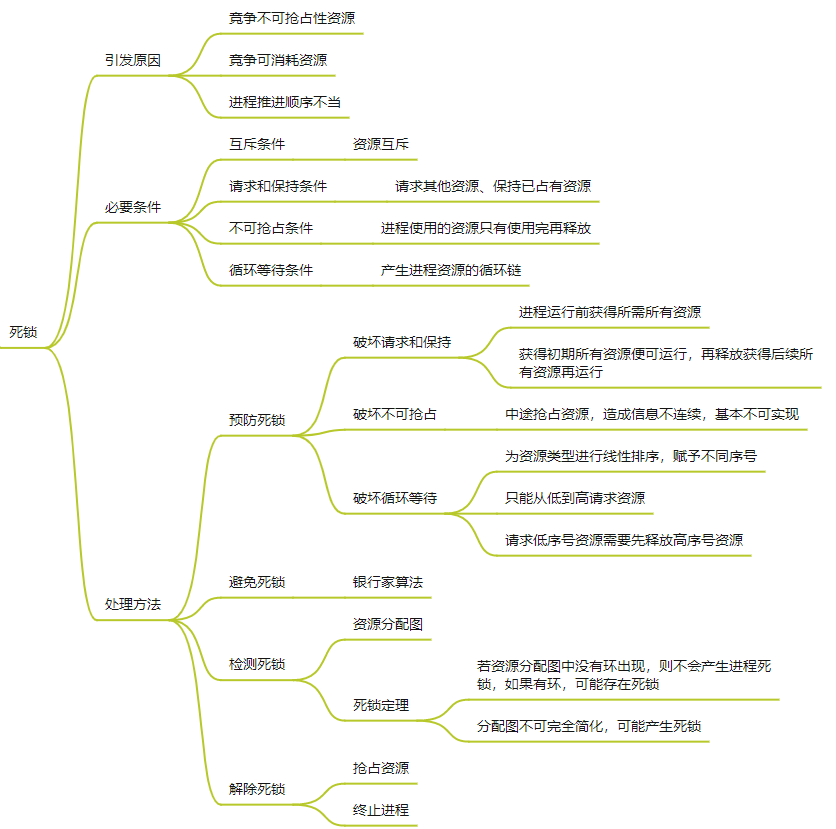

# BaoYan复习

# 线性代数

## 1 行列式

概念：

- 代数余子式（有正负号）、余子式

具体实现：

- 行列式求解
- 克拉默法则

线性方程组的 $|D| \neq 0$ ，则有唯一解 $x_1 = \frac{|D_1|}{|D|}, ..., x_n = \frac{|D_n|}{|D|}$  

## 2 矩阵

### 2.1 概念

- 方阵、对称矩阵、伴随矩阵

伴随矩阵： $A_{ij}$ 为 $a_{ij}$ 的代数余子式，伴随矩阵为
$$
A^{*} = 
\begin{bmatrix}
A_{11} & \cdots & A_{1n} \\
\vdots & \ddots & \vdots \\
A_{n1} & \cdots & A_{nn}
\end{bmatrix}
$$


- 矩阵变化

行变换：相当于左乘矩阵

列变化：相当于右乘矩阵

- 逆矩阵、非退化矩阵（n阶方阵、行列式为0）

逆矩阵：
$$
A^{-1} = \frac{1}{|A|} A^{*}
$$
矩阵可逆的等价条件：

1.  存在 `n` 阶矩阵 $B$ 使得 $AB = BA = E$ 
2.  $|A| \neq 0$ 
3.  $A$ 的行列向量组线性无关
4.  $A$ 是满秩矩阵
5.  齐次线性方程组 $AX = 0$ 只有零解
6.  $A$ 可以写成一系列初等矩阵的乘积
7.  $\lambda _i \neq 0$ 
8.  $A$ 的标准型是单位矩阵

- 矩阵的等价

$A$ 可以通过一系列初等变换变为 $B$ 矩阵

### 2.2 具体实现

- 矩阵方程求解 $AX = B$ 

$$
(A, B) \rightarrow (E, A^{-1} B) \\
X = A^{-1}B
$$

- 矩阵乘法、乘法运算规则
- 逆矩阵求解方法

1. 行初等变换法 $(A, E) \rightarrow (E, A^{-1})$ 或者列初等变换
2. 待定系数法，设一个矩阵，然后解方程

## 3 线性方程组

### 3.1 概念

- 增广矩阵 $(A, B)$ 
- 自由未知量（不贡献秩的列），固定未知量（贡献秩的列）
- 线性相关，线性无关，线性表出

线性表出：存在一组数 $k_1, \cdots, k_s$ ，使得 $\beta = k_1 \alpha_1 + \cdots + k_s \alpha_s$ 

线性相关： $\alpha _i$ 可由其他向量线性表出

线性无关：不存在向量可以被其他向量线性表出

- 向量组的秩、矩阵的秩

向量组的秩：最大线性无关组所含的向量个数

矩阵的秩：矩阵行（列）向量组的秩

### 3.2 具体实现

- 线性方程组的求解判定
  - 有解判定定理，唯一解 $r(A) = r(A,B) = n$ ，无穷解 $r(A) = r(A,B) \lt n$ 
  - 无解判定 $r(A) \neq r(A,B)$ 
- 解结构
  - 基础解系（自由未知量，非单位1的列，个数为 $n - r(A)$ ）
  
  > 特征向量：自由未知量的系数向量
  
  - 特解（常数向量，不带自由未知量）

## 4 特征值

### 4.1 概念

- 特征值、特征向量、特征矩阵、特征多项式

存在一个 $\lambda$ 使得 $AX = \lambda X$ ，$\lambda$ 是 $A$ 的一个特征值， $X$ 是属于 $\lambda$ 的一个特征向量

上式可以转化为 $(\lambda E - A) X = 0$ 

$\lambda E - A$ 为 $A$ 的特征矩阵，行列式 $|\lambda E - A|$ 为 $A$ 的特征多项式， $|\lambda E - A| = 0$ 为 $A$ 的特征方程

- 矩阵的迹

矩阵 $A$ 有多个特征值，则 $|A| = \lambda_1 \lambda_2 \cdots \lambda_n$ 

迹为主对角元素之和， $trA = \lambda_1 + \cdots + \lambda_n$ 

- 矩阵的相似

存在可逆矩阵 $P$ 使得 $P^{-1}AP = B$ ，则 $A$ 和 $B$ 相似

> 性质：
>
> 1. 相似矩阵具有相同的特征值
> 2. 相似矩阵行列式相等
> 3. 相似矩阵具有相同的迹

- 正交向量组、正交基、正交矩阵

正交向量组：向量组中的向量两两正交

正交基：向量组是一个基，且是正交的

正交矩阵： $A^{'} A = E$ 

### 4.2 具体实现

- 求 $A$ 特征值和特征向量

1.  $|\lambda E - A| = 0$ 求得 $A$ 的特征根
2. 特征根带入 $|\lambda E - A| = 0$ ，求得基础解系，所有的特征向量就是基础解系乘一个非零常数 $k$ 

- 例题：对矩阵 $A$ ， 求可逆矩阵 $C$ ，使 $C^{-1}AC$ 为对角阵

1.  $|\lambda E - A| = 0$ 求得 $A$ 的特征根
2. 特征根带入 $|\lambda E - A| = 0$ ，求得特征向量（列向量）
3.  $C$ 矩阵就是所有列特征向量的组合
4. 对角阵就是对应特征值的对角阵

- 将线性无关向量组转化为（单位）正交向量组


- 求正交矩阵 $T$ ，使 $T^{-1}AT$ 为对角矩阵

1. 根据 $|\lambda E - A| = 0$ 带入特征值求得基础解系
2. 进行施密特正交化方法，求得正交向量，然后再单位化求得单位向量
3. 单位向量组合起来就是正交矩阵 $T$ ，对角元素为对应的特征值

## 5 二次型

### 5.1 概念

- 二次型，标准二次型，二次型矩阵

$f(x_1, x_2, \cdots, x_n)$ 为 $n$ 元二次型，只含有平方项的二次型为标准二次型
$$
f = (x_1, \cdots, x_n)
\begin{bmatrix}
a_{11} & \cdots & a_{1n} \\
\vdots & \ddots & \vdots \\
a_{n1} & \cdots & a_{nn}
\end{bmatrix}
\begin{bmatrix}
x_1 \\
\vdots \\
x_n
\end{bmatrix}
= X ^ {'} A X
$$
矩阵 $A$ 为二次型矩阵

> 任何 $f(X) = X^TAX$ 都可以通过正交替换 $X = TY$ 化为标准型

- 二次型的秩： $A$ 的秩就为二次型的秩
- 正交替换（$\mathbf{X = CY}$，$\mathbf{C}$为正交矩阵）
- 矩阵的合同（$P^TAP$）

存在 `n` 阶可逆矩阵使 $B = C^{'}AC$ ，则称 $A$ 与 $B$ 合同

- 正定二次型

$$
\forall X \in R^n, f(X) > 0
$$

此时 $A$ 为正定矩阵

- 正定矩阵：$\forall \mathbf{X} \in R^n \hspace{1em} f(\mathbf{X}) > 0$ 为正定二次型， $A$ 矩阵为正定矩阵

>  $f(X) = X^TAX$ 正定的条件：
>
> -  $f$ 的正惯性系数为 $n$ 
> - 存在可逆矩阵 $D$ 使 $A = D^TD$ 
> -  $A$ 的特征值 $\lambda_i \geq 0$ 
> -  $A$ 的全部顺序主子式均大于0

- 半正定矩阵： $\forall \mathbf{X} \in R^n \hspace{1em} f(\mathbf{X}) \geq 0$ 为半正定二次型， $A$ 矩阵为半正定矩阵

> 负定： 小于0，半负定：小于等于0

- 正负惯性系数
- 顺序主子式

$D_1$ 为 左上角 1 阶方阵， $D_2$ 为左上角 2 阶方阵，...，$D_n$ 为左上角 n 阶方阵

### 5.2 具体实现

- 实二次型化为标准型

1. 二次型矩阵通过特征方程求特征向量
2. 特征向量正交，再单位化
3. 得到的列向量组合起来为正交矩阵 $T$ 
4. 线性替换 $X = TY$ 为正交替换，则 $f = X^TAX = Y^T (T^T A T)Y = Y^T C Y$ ， $C$ 为对应的特征值对角矩阵

# 概率论

## 1 概率

- 古典概型和几何概型
  - 古典概型（有限等可能）
  - 几何概型（无限等可能）
- 条件概率

$$
P(A|B) = \frac{P(AB)}{P(B)}
$$

- 全概率公式

$$
P(B) = \sum \limits_{i = 1}^n P(A_i)P(B|A_i)
$$

- 贝叶斯公式

$$
P(H|E) = \frac{P(H)P(E|H)}{P(E)} \\
P(B_i | A) = \frac{P(B_i)P(A|B_i)}{\sum_i P(B_i) P(A|B_i)} \\
P(H_i | E_1E_2 \cdots E_m) = \frac{P(E_1|H_i)P(E_2|H_i) \cdots P(E_m|H_i)P(H_i)}{\sum \limits_{j = 1}^n P(E_1|H_j)P(E_2|H_j) \cdots P(E_m|H_j)P(H_j)}
$$

- 先验概率和后验概率
  - 先验概率：事情未发生，根据以往数据分析得到的概率
  - 后验概率：事情已发生，这件事情发生的原因是由某个因素引起的概率

## 2 离散随机变量及分布

- 两点分布（01分布）$X \thicksim B(1, p)$

$$
P(X = 0) = 1 - p \\
P(X = 1) = p \\
p \in (0,1)
$$

- 二项分布（伯努利分布）$X \thicksim B(n, p)$

$$
P(X = k) = C_n^k p^k (1 - p)^{n - k} \hspace{1em} p \in (0,1), k = 0,1,2,\cdots, n
$$

- 泊松分布 $X \thicksim P(\lambda)$

$$
P(X = k) = \frac{\lambda ^ k e ^{- \lambda}}{k!} \hspace{1em} \lambda \gt 0, k = 0,1,2,\cdots
$$

- 几何分布 $X \thicksim G(p)$

$$
P(X = k) = (1 - p) ^ {k - 1} p \hspace{1em} p \in (0, 1), k = 1, 2, \cdots
$$

- 超几何分布 $X \thicksim h(n, N, M)$

$N$个产品，$M$个次品，从中无放回随机抽取$n$个，不合格数$X$服从超几何分布
$$
P(X = k) = \frac{C_{N - M} ^ {n - k}C_M^k}{C_N ^ n}
$$

## 3 连续随机变量及分布

- 均匀分布 $X \thicksim U(a, b)$

$$
f(x) = 
\begin{cases}
\frac{1}{b - a}, & a \le x \le b \\
0, &其他
\end{cases}
$$

- 指数分布 $X \thicksim E(\lambda)$

$$
f(x) = 
\begin{cases}
\lambda e ^{-\lambda x}, & x \gt 0 \\
0, &其他
\end{cases}
$$

- 正态分布（高斯分布）$X \thicksim N(\mu, \sigma ^ 2)$

$$
f(x) = \frac{1}{\sqrt{2 \pi} \sigma} \huge{e} ^ {\Large{- \frac{(x - \mu) ^ 2}{2 \sigma ^ 2}}}
$$

标准正态分布 $X \thicksim N(0, 1)$

## 4 随机变量数字特征

- 数学期望

离散分布的数学期望：

1. 两点分布 $p$

2. 二项分布 $np$

3. 泊松分布 $\lambda$

4. 几何分布 $\frac{1}{p}$

连续分布的数学期望：
$$
E(X) = \int _{-\infin}^{+ \infin} xf(x) dx
$$

1. 均匀分布 $\frac{a + b}{2}$
2. 指数分布 $\frac{1}{\lambda}$
3. 正态分布 $\mu$

- 方差

$$
D(X) = E[(X - E(X))^2] = E(X^2) - E^2(X)
$$


- 协方差

$$
Cov(X, Y) = E[(X - E[X])(Y - E[Y])] = E[XY] - E[X]E[Y]
$$

从数值来看，协方差的数值越大，两个变量同向程度也就越大。反之亦然。

- 相关系数

$$
\rho_{_{XY}} = \frac{Cov(X, Y)}{\sqrt{D(X)} \sqrt{D(Y)}}
$$

- 独立、互斥、相关（线性相关）

## 5 大数定理和中心极限定理

- 大数定理

样本数量很大的时候，样本均值和数学期望充分接近，也就是说当我们大量重复某一相同的实验的时候，其最后的实验结果可能会稳定在某一数值附近。

- 中心极限定理

大量（$n \to \infin$）、独立、同分布的随机变量之和，近似服从于一维正态分布。

随机变量之和的标准化变量为
$$
\eta = \frac{\sum \limits _{i = 1} ^{n} x_i - n \mu}{\sqrt{n} \sigma}
$$


均值为$\mu$，方差为$\sigma^2$的独立同分布的随机变量序列$x_1, x_2, \cdots, x_n$，只要$n$足够大，就有
$$
\frac{\sum \limits _{i = 1} ^{n} x_i - n \mu}{\sqrt{n} \sigma} \stackrel{近似}{\thicksim} N(0, 1)
$$

## 6 参数估计

极大似然估计要求所有采样都是独立同分布的

**就是利用已知的样本结果信息，反推最具有可能（最大概率）导致这些样本结果出现的模型参数值！**

求最大似然估计量 $\hat \theta$ 步骤：

1. 写出似然函数，似然函数越大越好

$$
L = \prod \limits _{i = 1} ^n f(x_i)
$$

2. 对似然函数取对数，整理

3. 求导数，让导数等于0

4. 解似然方程

# 高数

## 1 可导可微可积连续

- 对于一元函数，可导可微等价
- 可导一定连续，连续不一定可导（绝对值函数，连续但不可导）

## 2 中值定理

- 罗尔中值定理

$f(x)$ 在 $[a, b]$ 内连续，在 $(a, b)$ 内可导， $f(a) = f(b)$ ，则存在 $\xi \in (a, b)$ ，使得 $f{'}(\xi) = 0$ 

- 拉格朗日中值定理

$f(x)$在$[a, b]$内连续，在$(a, b)$内可导，则存在$\xi \in (a, b)$，使得$f{'}(\xi) = \frac{f(b) - f(a)}{b - a}$ 

- 柯西中值定理

$f(x),g(x)$在$[a, b]$内连续，在$(a, b)$内可导，且满足$g'(x) \neq 0 (a \lt x \lt b)$，则存在$\xi \in (a, b)$，使得$\frac{f'(\xi)}{g'(\xi)} = \frac{f(b) - f(a)}{g(b) - g(a)}$

## 3 梯度和方向导数

方向导数：
$$
对于f(x, y)在P(x_0, y_0)可微分，\frac{\partial f}{\partial l} \Bigg \vert _{(x_0, y_0)} = f_x(x_0, y_0) cos \alpha + f_y(x_0, y_0)cos \beta = (f_x(x_0, y_0), f_y(x_0, y_0)) \cdot (cos\alpha, cos\beta)
$$
当偏导向量和方向向量同向时，方向导数最大，那么把这个方向向量就叫做**函数在该点的梯度**。

梯度是使得方向导数变化最大的方向向量，使函数值增长最快的方向。

>  梯度下降一般是沿着梯度相反的方向

## 4 凹凸函数和琴生不等式

凸函数：
$$
f(\frac{x_1 + x_2}{2}) > \frac{f(x_1) + f(x_2)}{2}
$$
凹函数：
$$
f(\frac{x_1 + x_2}{2}) < \frac{f(x_1) + f(x_2)}{2}
$$

## 5 偏导偏微全微

- 偏导

对于某一自变量的增量，对应有相应函数的增量，如果某自变量增量趋近于0时，极限存在，即为偏导数。
$$
\frac{\partial z}{\partial x} = \frac{\partial z}{\partial u} \frac{\partial u}{\partial x} + \frac{\partial z}{\partial v} \frac{\partial v}{\partial x}
$$

- 全微分

$$
对于 u= f(x, y, z) \hspace{1em}du = \frac{\partial u}{\partial x} dx +  \frac{\partial u}{\partial y} dy + \frac{\partial u}{\partial z} dz
$$

相互关系：

偏导函数连续一定可微

可微一定连续，可微一定偏导函数存在，可微一定沿任何方向导数均存在

连续一定有极限

# 离散数学

## 1 集合论

概念：

- 关系的自反性、反自反性、对称性、反对称性、传递性
- 闭包
- 次序关系：偏序$\le$（自反、反对称、传递）和拟序$\lt$（反自反，传递）
- 等价关系：自反、对称、传递

## 2 代数系统

概念：

- 单位元、逆元素、零元素
- 同构、同态
- 群（结合律，存在单位元素，逆元素）环格

## 3 图论

概念：

- 完全图，子图，补图，零图，平凡图，简单图（没有多重边）
- 通路，回路，连通图：强连通（有向图任意两点互相可达），弱连通（有向图去除方向任意两点均可达），单向连通（至少有一向是可达的）
- m元树，生成树，最小生成树
- 欧拉图（一条回路经过每条边一次，具有该回路的图是欧拉图）：每个节点均具有偶次数；$i,j$ 存在欧拉回路的充要条件：$i,j$ 的次数均为奇数，其余为偶数

## 4 数理逻辑

- 命题连接词
- 范式（析取范式，合取范式）
- 谓词逻辑

# 计算机网络

## 1 应用层

### 1.1 HTTP

持续连接

非持续连接

### 1.2 SMTP/POP3

推协议：SMTP、HTTP

拉协议：POP3、IMAP、HTTP

### 1.3 DNS

本地DNS服务器

解析方式：

- 递归解析

- 迭代解析

## 2 运输层

复用和分用

### 2.1 UDP

地址标识：（目的主机IP + 进程端口号）

特点：

1. 无连接
2. 无拥塞控制
3. 不可靠，数据可靠通过应用层实现

> 但有校验和，检测出错后，报告应用层，运输层不改动

### 2.2 TCP

地址标识：（源主机IP + 源端口号 + 目的主机IP + 目的端口号）

面向连接的可靠传输协议：

- 面向连接：三握四挥
- 可靠传输：差错检测，确认重传，定时器管理
- 流量控制：滑动窗口
- 拥塞控制：慢开始，拥塞避免，快重传，快恢复

三次握手：

1. TCP请求报文段
2. TCP连接响应报文段
3. TCP连接确认（附带应用层请求报文）
4. 应用层响应报文进行响应

四次挥手：

1. 客户（客户端和服务端都可以主动提出）主动提出释放连接请求
2. 服务端进行响应确认，通知应用进程关闭服务线程
3. 服务端关闭线程后，发送关闭连接的确认响应
4. 客户端接受到关闭通知后，发送确认响应

可靠传输：

> TCP头部包含：校验和，序号和确认号，超时计数器

TCP超时重发定时器的值是自适应变化的

停等协议：发送方等待接收方确认才能发，不能流水线发送，信道利用率低

流水线协议：发送方在等待确认时可以继续发送报文，信道利用率提高

回退N步协议：报文段错误后，将重发此报文段后续所有报文段，提高信道利用率，浪费带宽（重发所有无序的报文段）

选择重传协议：缓冲其他后续接受到的报文段，发送方仅仅重发错误的报文段

流量控制：

滑动窗口协议：

1. 收发主机设置各自的TCP数据缓冲区
2. 在缓冲区设置发送窗口和接收窗口
3. 发送方窗口等于接收方窗口

> 如果接收方处理数据的速度大于接受数据的速度，接受方窗口大小就会扩展，并且之后会把窗口大小传给发送方，引起发送方窗口增大。反之，接收方窗口减小，引起发送方窗口减小。

拥塞控制：

传送数据过多，数据重传。拥塞窗口随拥塞情况动态变化

> 接受窗口表示接收方缓冲区的接受容量（运输层）
>
> 拥塞窗口表示网络的吞吐量（网络层）

发送方窗口大小=min(接收窗口，拥塞窗口)

慢开始算法：拥塞窗口小于慢开始门限，新拥塞窗口 = 原拥塞窗口 * 2

拥塞避免算法：当前拥塞窗口大于慢开始门限，新拥塞窗口 = 原拥塞窗口 + 1MSS

> 在定时器超时前，未受到确认，认定网络拥塞发生。此时重设门限值为当前拥塞窗口的一半。重新慢开始算法，拥塞窗口从1MSS开始

快重传算法：发送方发送 $M_1, M_2, M_3, M_4, M_5, M_6$ ，$M_3$ 丢失，接收方收到无序报文段，对于 $M_4, M_5, M_6$ 的回复重复确认 $M_2$ ，发送方立即重传 $M_2$ ，此时并没有超时，网络没有拥塞，防止误判重新慢开始，防止网络传输率下降

快恢复算法：发送方收到三个连续重复确认，直接执行拥塞避免算法

> 此时的操作为：慢开始门限等于当前拥塞窗口的一半，当前拥塞窗口等于慢开始门限。也就是当前拥塞窗口直接等于新的慢开始门限，就要执行拥塞控制算法

## 3 网络层

### 3.1 网络层服务

通信网络：

- 电路交换网络：独占预先分配链路资源
- 分组交换网络：按需分配链路资源
  - 虚电路网络：发送数据报前确定了线路
  - 数据报网络：发送数据报前不确定线路（采用）

数据报统一地址寻址：最长前缀匹配原则来确定数据转发的网络接口（二叉树查找路由表）

路由与转发：

路由：软件实现，确定从发送主机到接受主机之间的传输数据报的路径，主要应用于整个网络

转发：硬件实现，从路由器一个网络接口接受，另一个网络接口转发出去。（检索转发表，比对首部参数值，确定出口）

> 转发表由路由协议中的路由算法决定

数据报的拆分和重组：MTU和MSS

只在目的主机进行数据报分片的重组，路由器只转发，不组合

### 3.2 IP协议

数据报格式：

分片标识号：同一数据报的分片具有相同的标识号

分片标志位：`MF = 0` 最后一片，否则还有

分片偏移量：封装的字节顺序，以`8 Byte`为单位计算

> 分片是因为不同的网络MTU不一样，需要对数据进行拆分

IPv4地址：IP地址=网络ID+主机ID（网络ID和主机ID都是既不能全0又不能全1）


A：网络位8位，主机位24位（127为特殊地址不分配）

B：网络位16位，主机位16位

C：网络位24位，主机位8位

私有地址：内部网络使用，公网不被承认

- A：10.0.0.0
- B：172.16.0.0 - 172.31.0.0
- C：192.168.0.0 - 192.168.255.0

三层网络划分：

IP地址 = 网络ID + 子网ID + 主机ID（主机高位进行子网划分）

同一子网的主机具有相同的子网地址，可以直接互通数据报，路由器的不同接口连接不同的子网

子网掩码 & IP地址 = 子网地址（网络ID+子网ID+主机ID（主机ID全0））

子网掩码作用：求得子网地址，划分子网

> 划分子网的数量由掩码的主机地址中1的数量`n`决定，为 $2 ^ n - 2$ 

路由选择根据网络ID和子网ID进行，局域网之外根据网络ID，局域网之内根据子网ID

网关：路由器某一网络接口的IP地址，与主机在同一子网中

同一子网判断：主机A子网掩码与B的IP地址得到A认为B的子网地址，然后将A的子网地址和B的子网地址比较

地址分配：

- 静态配置：手动配置
- 动态配置：DHCP（发现，提供，选择，确认）

CIDR无类域间路由：使用不属于任何类的网络地址块

地址格式： `a.b.c.d/x` 这里的 `x` 表示地址中网络部分的位数。

好处：提高IP地址分配效率，提高路由效率（可以进行路由聚合，多个子网汇聚成一个大子网）

最小的子网：主机位最小为2位

### 3.3 NAT

私有IP地址转化为公有IP地址

路由器IP地址，一个配置私有IP地址，一个配置公有IP地址

>  使用NAT的局域网运行一个对外的服务器，需要解决穿透NAT问题

NAT中有一张转换表（源私有IP，源端口号，公有地址，新端口号）

转发数据报到外网添加新记录，从外网接受数据时，查找相应记录，转发至内网

IP数据报承载的如果不是TCP，则NAT无法工作

### 3.4 IPv6

128位，头部固定长度40字节，IPv6只允许在发送端进行数据报拆分，分为8部分

单播地址：一个单播地址对应一个唯一的网络接口（010标识该地址为单播地址）

多播地址：一个多播地址对应一组网络接口，数据报送到该地址对应的一组接口上（数据报送到该组的每一个接口）

任播地址：一个任播地址对应一组网络接口（数据报转发到该组对应的最近的一个接口）

IPv4路由也可分片，IPv6只在发送主机分片（路由器发现大于MTU的数据报直接丢弃，并发送ICMP差错报告）

过渡技术：

- 隧道技术
- 双协议栈技术

### 3.5 ICMP

ICMP被封装在IP数据报中进行传输

- 差错报文

传输数据出错，ICMP向发送主机汇报情况，不进行纠错。

- 网络探询报文

确定网络层是否联通（`ping`命令）：发送主机，发送ICMP回送请求报文；目的主机返回ICMP回送应答报文

确定往返时间：发送主机，发送ICMP时间戳请求报文；目的主机返回ICMP时间戳应答报文

### 3.6 ARP地址解析协议

把IP地址映射到MAC地址，网络接口之间传递数据看的是MAC地址

应用范围：同一子网中

ARP是即插即用的，自动创建ARP地址解析表（IP地址，MAC地址，TTL），无需管理

同一子网中，主机A的ARP表中没有主机B的MAC地址，解析过程：

- 主机A发送ARP请求数据报，发送广播帧到子网中
- 子网中所有网络接口收到广播帧，看目的IP地址与自己IP地址是否匹配，匹配的话返回ARP响应数据报
- 主机A接受到相应数据报，保存在ARP表中

不同子网中

- 主机A查找ARP表，获得默认网关的MAC接口，发送数据报封装成帧给默认网关
- 默认网关提取IP数据报，查找路由表，转发至对应接口
- 接口查找ARP表得到B的MAC地址，封装成帧发给B

# 操作系统

## 1 计算机系统概述

## 2 进程与线程

### 2.1 进程与线程

进程组成：程序段，数据段，PCB

线程与进程的关系

进程通信的方式：

- 共享存储
- 消息传递
- 管道通信

### 2.2 处理机调度

调度方式：非抢占式调度和抢占式调度

调度算法：

- 先来先服务FCFS
- 短作业优先SJF
- 优先级调度
- 高响应比优先 响应比：(等待时间 + 要求服务时间) / 要求服务时间
- 时间片轮转调度
- 多级队列调度
- 多级反馈队列调度

实时调度算法：分为硬实时和软实时

常用实时调度算法：

- 最早截止时间优先算法EDF（截止时间越早优先级越高）
- 最低松弛度优先算法LLF（松弛度=必须完成的时间-还需要的运行时间-当前时间）
- 优先级倒置算法

### 2.3 同步与互斥

同步机制遵循准则：空闲让进，忙则等待，有限等待，让权等待

解决临界区访问的工具：互斥锁

信号量机制：解决互斥和同步问题，只能被两个标准的原语访问，P操作和V操作

- 实现同步：公共信号量初值为0
- 实现进程互斥：信号量初值为1
- 实现前驱关系：信号量初值为0

**管程：**保证了进程互斥，无需程序员实现互斥，由数据结构和对数据结构的操作过程组成

封装对应操作，统一管理共享资源

条件变量：管程中的阻塞原因（如果进程进入管程时由于某种原因阻塞，不释放管程那么其他进程也无法进入），每个条件变量保存了一个等待队列，记录因该条件变量而阻塞的进程

条件变量的两种操作：wait和signal操作

wait：条件不满足时，调用wait将自己插入条件的等待队列中，并释放管程

signal：对应的条件发生变化，调用signal唤醒一个因该条件而阻塞的进程

**同步问题：**

- 生产者消费者问题

> 先获取资源信号量，再获取互斥信号量mutex

mutex：互斥信号量

empty：空缓冲区数量

full：满缓冲区数量

- 读者写者问题

count：读进程数目

rw：读和写的互斥信号量

mutex：count的互斥访问信号量

- 哲学家进餐问题
- 贪睡的理发师问题

### 2.4 死锁



## 3 内存管理

### 3.1 概念

程序变为在内存中执行的程序的步骤：

- 编译
- 链接：静态链接，装入时动态链接，运行时动态链接
- 装入：编译时（绝对装入）、加载时（可重定位装入）、执行时（动态运行时装入）

内存连续分配管理方式：

- 单一连续分配：整个内存空间由内存独占
- 固定分区分配：内存空间划分为固定大小的区域，每个分区装入一道作业。存在内部碎片
- 动态分区分配（可变分区分配）：存在外部碎片
  - 首次适应算法：找第一个大小能满足的空闲分区进行分配
  - 循环首次适应算法：从上次查找结束的位置继续查找
  - 最佳适应算法：按容量递增对空闲分区进行排序，找到能满足的最小的分区进行分配
  - 最坏适应算法：按容量递减排序，找最大的空闲分区分配

分页管理：页内碎片，页表（一般在内存中），正常两次访存（第一次访问页表，第二次访问数据），快表（加速访存）

页表寄存器（存页表在内存的起始地址和页表长度）

分段管理：按照用户进程中的自然段划分逻辑空间

### 3.2 虚拟内存管理

请求调入和置换功能

请求分页管理，页面置换算法：

- 最佳置换算法OPT：淘汰最长时间不被访问的（未来情况下）
- 先进先出FIFO
- 最近最久未使用LRU：过去一段时间最长未被使用
- CLOCK置换算法：设置访问位和修改位，给予二次驻留内存的机会

抖动：页面刚换出又要调入内存

## 4 文件管理

## 5 输入输出管理


# 数据结构

# 计算机组成原理

# Machine Learning

参考：https://wyqz.top/p/808139430.html

# 其它（技术）

## 1 Linux

### 1.1 基础命令

### 1.2 Git

参考：https://wyqz.top/p/1843856130.html

### 1.3 Docker

### 1.4 Shell

## 2 C/C++

- 基础用法：

函数模板、一元作用域运算符、引用、函数重载、

- 面向对象

1. 共有，保护，私有

2. 构造函数和析构函数：多类时的执行顺序
3. 

- 编译过程

## 3 Python

概念：

- 闭包、装饰器

## 4 Latex

https://wyqz.top/p/917541138.html

# 项目和科研

## 1 项目：QQ机器人

机器人称之为**协议端**

协议端可以通过 http、websocket 等方式与之通信，这个通信往往是双向的：

- 一方面，协议端可以上报数据给 NoneBot，NoneBot 会处理数据并返回响应给协议端；
- 另一方面，NoneBot 可以主动推送数据给协议端。而 NoneBot 便是围绕双向通信进行工作的。

倘若一个协议端与 NoneBot 进行了连接，NoneBot 的后端驱动 `Driver` 就会将数据交给 `Adapter`，然后会实例化 `Bot`，NoneBot 便会利用 `Bot` 开始工作，它的工作内容分为两个方面：

1. **事件处理**，`Bot` 会将协议端上报的数据转化为 `Event`（事件），之后 NoneBot 会根据一套既定流程来处理事件。
2. **调用 `API`**，在**事件处理**的过程中，NoneBot 可以通过 `Bot` 调用协议端指定的 `API` 来获取更多数据，或者反馈响应给协议端；NoneBot 也可以通过调用 `API` 向协议端主动请求数据或者主动推送数据。


## 2 项目：高空坠物APP

### 模块

- 微波模块`pbIn`

设置为外部中断模式，需要绑定外部中断

- 热释电传感器模块`pIR`

设置为输入模式

- 继电器引脚`pRelay`

设置为输出模式，`LOW`触发

> 初始时继电器为打开状态，需要吸附磁铁

### 流程

- 初始化函数

打开继电器，吸附磁铁

- 循环函数

当计数周期大于`3s`时，清除状态记录（坠物`3s`内一定会下落）

- 定时器中断（`600ms`定时器触发）

如果热释电传感器为输入为`LOW`，需要重新开始计数，且：

1. 大于阈值，触发
2. 否则上次下降沿计数值更新为当前计数值

- 外部中断（下降沿触发）

1. 检测下降沿状态为`false` ：将其设置为`true`，计数清零，**开始定时器中断**
2. 检测下降沿状态为`true` ：计数值加一

```c
#include <MsTimer2.h>

//微波模块中断引脚=2 / int0
const int pbIn = 0;
//热释电传感器引脚
const int pIR = 4;
//继电器引脚1
const int pRelay1 = 9;

//计数变量
int count = 0;
//上一次计数结果
int lastCnt = 0;
//上一个计数时间
unsigned long lastMills;
//是否在检测下降沿
bool isDetectingFalling = false;

//清空计数周期(ms)
#define MILLIS_INTERVAL 3*1000
//计数阈值
#define COUNT_MAX       25

#define RELAY_ON LOW

void setup()
{
	Serial.begin(115200);
	//绑定中断
	attachInterrupt(pbIn, IRQ0_Handler, FALLING);
	//设定PINMODE
	pinMode(pIR, INPUT);
	pinMode(pRelay1, OUTPUT);
	//初始化: 继电器开 
	digitalWrite(pRelay1, RELAY_ON);
	MsTimer2::set(600, MsTimer2_IRQ_Handler);
}

void loop()
{
	//清除上一个记录
	if (millis() > lastMills + MILLIS_INTERVAL) {
		lastCnt = 0;
		lastMills = millis();
		Serial.println("(!0y)");
		//关继电器
		digitalWrite(pRelay1, HIGH - RELAY_ON);
	}
}

//外部中断
void IRQ0_Handler()
{
	if (!isDetectingFalling) {
		isDetectingFalling = true;
		count = 0;
		MsTimer2::start();
	}
	else {
		count++;
	}
}

//定时任务中断
void MsTimer2_IRQ_Handler()
{
	if (digitalRead(pIR) == LOW) {
		//取消下降沿计数
		isDetectingFalling = false;
		Serial.println(lastCnt + count);
		//大于阈值, 触发
		if (lastCnt + count > COUNT_MAX)
		{
			digitalWrite(pRelay1, RELAY_ON);
			Serial.print("(!1z)");
			lastCnt = 0;
		}
		else {
			lastCnt = count;
			lastMills = millis();
		}
		MsTimer2::stop();
	}
}
```


## 3 科研：Yolov5

## 4 科研：基于C++17线程池实现


# 英语
