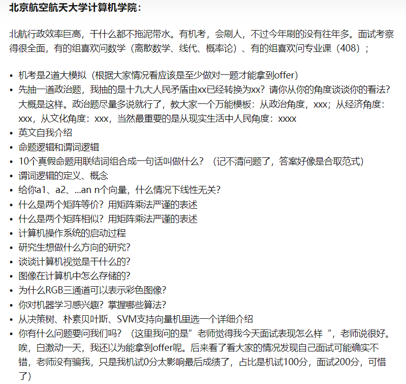
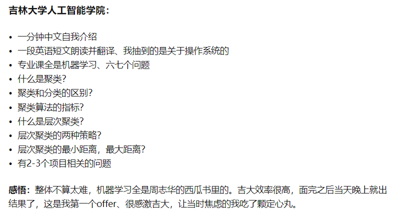

# 一、材料准备（4月之前尽早准备好）

## 1 套磁准备

- [x] 套磁信
- [ ] 寻找意向老师、意向院校

## 2 夏令营书写材料

- [ ] 1000字自述、500字自述

- [ ] 研究生阶段科研规划
- [x] 简历
- [ ] 推荐信

## 3 整理材料

- [x] 成绩单
- [x] 排名证明
- [x] 四六级证书
- [x] 竞赛证书

## 4 面试准备

- [ ] 个人介绍中文、英文
- [ ] 

保研夏令营需要准备哪些申请材料？三步搞定！ - 保研圈的文章 - 知乎 https://zhuanlan.zhihu.com/p/479460182

# 二、保研经验

- 尽量使用夏令营wl去冲（低风险）
- 成绩单加盖公章（五月份之前）
- 导师评价网
- 交叉学科可以捡漏

# 三、院校选择

- 中科院计算所，姚建业2023进了
- 北航 吴程程

# 四、院校经验

## 1 北航

- 2023届

》》》2019《《《

计组：

1. 解释下什么是DMA
2. 说下五级流水CPU的各阶段
3. 执行单条指令时单周期CPU和五级流水CPU谁更快？为什么？

操作系统：

1. 说下进程间通信的几种方式
2. 简要介绍一下分页分段

计网：

1. 说下TCP和UDP区别
2. 说下网络中的主机通信流程
3. 一个主机将两个端口接到网络上是否会提升吞吐量？为什么？

数据结构：

1. 说下快排过程
2. 如何判断一个单链表是否是循环链表（要给出一个比遍历更快的方法，貌似是两个指针一个每次前进1步、一个每次前进2步，相遇则循环）
3. 介绍下平衡二叉树

线代：

1. 介绍下什么是矩阵的秩
2. 介绍下特征值与特征向量的意义
3. 介绍下线性相关和线性无关

离散：

解释下等价关系和等价类

概率论：

1. 解释下大数定律
2. 说一下全概率公式和贝叶斯公式
3. 介绍下正态分布

机器学习：

1. 机器学习和深度学习的差别联系
2. 梯度下降法和牛顿迭代法的算法过程

- 政治：时事或政策，发表看法

- 英语：**英文自我介绍（学习成绩，学科，竞赛，科研，兴趣爱好，未来展望）**，朗读并翻译，英语解释OS

- 项目：创新点，算法，对某些概念的理解，项目细节，遇到的困难，如何解决的

- 竞赛：遇到的困难，如何解决的

- 专业提问：

  - 数据结构：栈，队列，归并排序，完全无向连通图的最小生成树的边数

  - 数学：可导，连续，可微，收敛

    1+1/2+1/3+1/4+……是否收敛？上限函数是什么？

## 2 人大

高瓴：

笔试：数据结构：按填空考察，比如建堆结果，一趟快排结果，树和森林直接的转换，kmp算法next数组和nextval数组的求解，prim算法选点顺序，字符串tail()函数相关运算求解。数学：一道概率论大题，一道线性代数大题，比如涉及矩阵论等知识

## 3 吉大

## 4 南大

》》》2018《《《

- 怎么提高计算机的处理速度
- 提高主频，并行处理，老师说还有一个字长。
- 并发和并行的区别？
- udp怎么保证传输质量（钓鱼题）
- 三次握手交换了什么信息？
- 验证码识别项目：图像在神经网络里以什么方式计算？

机试：

- 给出一个多叉树（多于二叉）的先序遍历和后序遍历，（每个节点以字符串标识），求该树的深度。

- 给出初始单词，终止单词，以及词典，所有单词均为长度相等的小写字母串，求从初始单词变换到终止单词的路径长度。每次变换只允许改变一个字符，且所有中间单词只能是词典中的，若不能做到则输出0。

  hit
  cog
  hot dot dog cog dig
  该样例中 hit hot dot dog cog 路径长度为5，词典单词数<=20000 串长度<=5

- 一台机器有 ni 张面值为 ki 的纸币，给定一个c，求小于等于c的一个最大金额，使得机器能恰好给出。
  c<=100000 ni<=1000 ki<=1000 种类数<=10

》》》2022《《《

https://zhuanlan.zhihu.com/p/569448591

LAMDA实验室：

https://blog.csdn.net/qian2213762498/article/details/80534067

https://zhuanlan.zhihu.com/p/266870455

## 5 中山

计算机：

机试：

- 继承、多态、构造和析构函数等语法题，栈、队列等数据结构题，递归、深度优先搜索、哈希表、图等算法题。

## - 其他

- 2022 北理工进夏令营学校也鸽了
- 中科大 网安入营130，参加100人，和导师双选制
- 复旦强com，专硕无宿舍，英语免试项目问题和自我介绍，问专业问题深度很深，入营60，优营率20%
- 科大网安：两轮面试10min（5minPPT，2专业问题）+10min（3minPPT，1个英文问题）（通过性面试，选拔性面试）。网络，密码学
- 中山网安：一轮面试，数据结构问的多，提前联系
- 华科需要老师推荐才能入营，要套磁，优营前10才可以填学硕
  - https://blog.csdn.net/qq_46632578/article/details/128580367
- 国防科技大学 CS：入营600左右，要360个，问软著，研一每月1000，研二每月3000，大工程博士1 + 4（第一年在学校后面在央企打工）培养，双导师培养；学硕+预推免录取90人；会有政审，体检
  - 电子对抗学院，前身解放军电子工程学院，研究生工资较多3000以上
  - 电子科学学院，线下，经费多，工资3500+。入营180，优营105
- 武大 预推免：有机试（OI赛制）笔试
- 中科大先进技术研究院：导师推荐入营，弱com，导师推荐入营，入营200，160导师推荐，简历提问。补助不少
- 中科大苏研院：推荐周少华老师
- 中科大科学岛：与中科大相比，最简单
- 北邮网安8组：
- 武大遥感国重：英语提问，联系导师没有，为什么网安却做其他的项目或东西。
- 北大深圳信工学院可能会让做项目
- 中科院计算机所，弱com
- 北大软微（学费很贵），正常面试，翻译文献，
- 南开网安弱com，专硕无宿舍，第一轮面试很重要基本就有结果，第二轮流程，无排名，老师单独面试为主
- 中南夏令营预推免一起

# 五、面试

## 1 英语

- 介绍
  - 介绍自己、家乡

- 相关问题
  - 最喜欢的课程，为什么
  - 为什么选择这个学校
  - 在某项目中的工作是什么

- 文献翻译

## 2 数学（复习很重要）

- 线性代数
  - 特征值分解
  - 正定矩阵是什么

- 概率论（概念）
- 高数

## 3 408（复习很重要）

## 4 项目论文

- 数据集来源
- 负责是什么
- 算法原理
- 为什么选择这个算法，比较了吗？

## 5 老师提问

- 你还报了哪些学校

