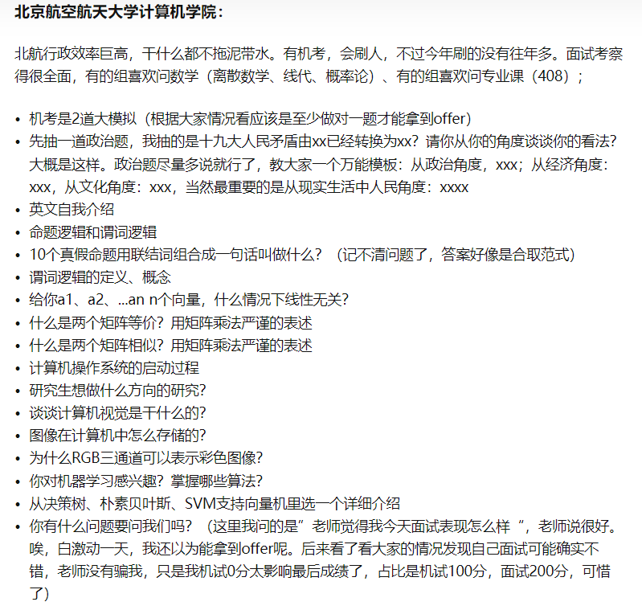
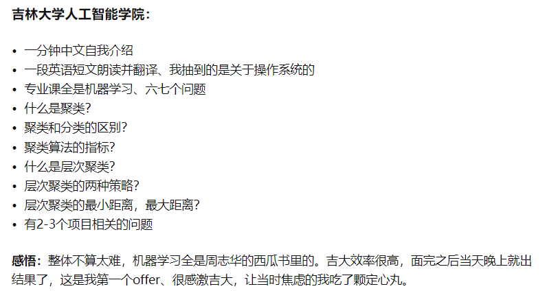
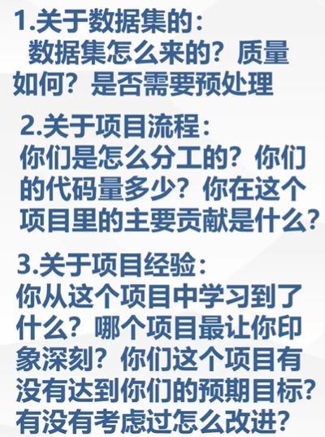

# 

# 一、院校问答

## 1 北航

- 2023届



》》》2019《《《

计组：

1. 解释下什么是DMA
2. 说下五级流水CPU的各阶段
3. 执行单条指令时单周期CPU和五级流水CPU谁更快？为什么？

> 在单周期CPU中，每个指令都需要完成所有的操作，包括取指令、译码、执行、访存和写回，这些操作都在一个时钟周期内完成。单周期CPU的优点是简单易懂、实现容易，但是由于所有指令的执行时间相同，可能会导致一些指令的执行时间较长，浪费了一些时钟周期。
>
> 而五级流水CPU则将指令的执行分成了五个阶段，每个阶段都可以并行处理不同的指令，从而实现了指令级并行。这种设计可以大大缩短指令的执行时间，提高CPU的效率。但是五级流水CPU也有缺点，就是可能会出现数据冲突，导致CPU需要停顿等待数据，浪费一些时钟周期。
>
> 因此，在执行单条指令时，如果指令的复杂度较低且没有数据冲突，那么五级流水CPU可能更快，因为它可以将指令的执行时间分成五个阶段并行处理。但是如果指令的复杂度较高或者存在数据冲突，那么单周期CPU可能更快，因为它可以在一个时钟周期内完成指令的执行。

操作系统：

1. 说下进程间通信的几种方式

> - 管道通信：管道是一种半双工的通信方式，它需要在两个进程之间建立一个管道，其中一个进程将数据写入管道，另一个进程则从管道中读取数据。管道通常用于父子进程之间的通信。
> - 共享内存（Shared Memory）：共享内存是一种高效的进程间通信方式，它允许多个进程共享同一块物理内存，从而避免了数据复制的开销。共享内存需要使用信号量等同步机制来避免数据竞争。
> - 消息队列（Message Queue）：消息队列是一种在进程之间传递消息的机制，它允许多个进程向队列中写入消息，其他进程则可以从队列中读取消息。消息队列通常用于进程之间的异步通信。
> - 信号量（Semaphore）：信号量是一种计数器，用于控制对共享资源的访问。多个进程可以通过对信号量的加锁和解锁操作来协调对共享资源的访问。

2. 简要介绍一下分页分段

> 分页和分段是操作系统中的内存管理技术，用于将物理内存空间映射到逻辑地址空间，从而为不同的进程提供独立的内存空间。
>
> 分页（Paging）是将物理内存划分成固定大小的页面（Page），逻辑地址也被划分成与页面大小相同的页（Page）。每个进程都有自己的页表，用于将逻辑地址映射到物理地址。当一个进程访问某一页时，操作系统会将页表中对应的物理地址装入内存，并将逻辑地址转换为物理地址，从而实现进程的内存访问。
>
> 分段（Segmentation）是将逻辑地址空间划分成多个段（Segment），每个段都有自己的起始地址和长度。每个进程也有自己的段表，用于将逻辑地址映射到物理地址。当一个进程访问某个段时，操作系统会将段表中对应的物理地址装入内存，并将逻辑地址转换为物理地址，从而实现进程的内存访问。
>
> 与分页相比，分段的主要优点在于可以为不同的段分配不同的权限和保护机制，从而提高了系统的安全性和灵活性。而分页则可以更好地利用物理内存空间，减少了内存碎片的浪费。
>
> 需要注意的是，分页和分段并不是互斥的技术，它们可以结合使用。例如，操作系统可以将一个进程的逻辑地址空间分成多个段，每个段再划分成多个页面，从而实现更细粒度的内存管理。

计网：

1. 说下TCP和UDP区别
2. 说下网络中的主机通信流程
3. 一个主机将两个端口接到网络上是否会提升吞吐量？为什么？

数据结构：

1. 说下快排过程
2. 如何判断一个单链表是否是循环链表（要给出一个比遍历更快的方法，使用快慢指针进行遍历，判断是否存在循环，两个指针一个每次前进1步、一个每次前进2步，相遇则循环）
3. 介绍下平衡二叉树

线代：

1. 介绍下什么是矩阵的秩
2. 介绍下特征值与特征向量的意义

> 特征向量可以用来描述矩阵的变换方向，而特征值则可以用来描述变换的程度。

3. 介绍下线性相关和线性无关

离散：

解释下等价关系和等价类

>等价关系是一种二元关系，它满足自反性、对称性和传递性。具体来说，如果R是集合X上的二元关系，那么R是等价关系当且仅当：
>
>1. 自反性：对于任意的x∈X，都有xRx。
>2. 对称性：对于任意的x,y∈X，如果xRy，则yRx。
>3. 传递性：对于任意的x,y,z∈X，如果xRy且yRz，则xRz。
>
>等价关系将集合X划分成了若干个等价类，每个等价类包含所有与这个元素等价的元素。具体来说，对于一个等价关系R，其定义的等价类为：
>
>1. 对于任意的x∈X，x属于它自己的等价类。
>2. 如果x和y属于同一个等价类，那么y也属于x所在的等价类。
>3. 如果x和y属于不同的等价类，那么它们之间不满足等价关系。
>
>等价类可以看做是一组相互关联的元素，它们具有相同的性质。例如，对于一个正整数集合，如果定义等价关系R为模n同余关系，即xRy当且仅当x mod n = y mod n，那么这个等价关系将集合划分成了n个等价类，每个等价类包含所有模n同余的正整数，可以表示为{0, n, 2n, 3n, ...}、{1, n+1, 2n+1, 3n+1, ...}、{2, n+2, 2n+2, 3n+2, ...}等。

概率论：

1. 解释下大数定律
2. 说一下全概率公式和贝叶斯公式
3. 介绍下正态分布

> 正态分布（Normal Distribution），也称为高斯分布（Gaussian Distribution），是概率论和统计学中最为重要的分布之一。它的概率密度函数具有钟形曲线的形状，分布在平均值附近的概率较高，而在两侧概率逐渐减小，符合大数定律和中心极限定理。
>
> 正态分布的概率密度函数是：
> $$
> f(x)=\frac{1}{\sigma\sqrt{2\pi}}e^{-\frac{(x-\mu)^2}{2\sigma^2}}
> $$
> 其中，$\mu$是正态分布的均值，$\sigma$是正态分布的标准差。正态分布的均值、方差和标准差都相等，而且其概率密度函数关于均值对称。
>
> 正态分布的重要性在于，许多自然现象和社会现象都服从正态分布。例如，人的身高、体重、智商等指标，财富、收入、股票价格、房价等经济指标，物理实验中的测量误差等都可以用正态分布来描述。
>
> 在实际应用中，正态分布经常被用作模型的假设或者检验的基础。例如，假设某个数据集服从正态分布，则可以使用正态分布的性质来进行统计分析，如计算置信区间、进行假设检验等。此外，正态分布还有大量的应用，如在机器学习中的神经网络中被用作激活函数、在金融工程中被用于模拟股票价格的波动等。

机器学习：

1. 机器学习和深度学习的差别联系
2. 梯度下降法和牛顿迭代法的算法过程

- 政治：时事或政策，发表看法

- 英语：**英文自我介绍（学习成绩，学科，竞赛，科研，兴趣爱好，未来展望）**，朗读并翻译，英语解释OS

- 项目：创新点，算法，对某些概念的理解，项目细节，遇到的困难，如何解决的

- 竞赛：遇到的困难，如何解决的

- 专业提问：

  - 数据结构：栈，队列，归并排序，完全无向连通图的最小生成树的边数

  - 数学：可导，连续，可微，收敛

    1+1/2+1/3+1/4+……是否收敛？上限函数是什么？

》》》2021《《《

```text
1.政治题(不算分，说个差不多就行)
2.英语:自我介绍
3.离散数学:相等关系和偏序关系是什么?闭包是什么?给你一个关系，怎么得到它的自反闭包?对称闭包?传递闭包?
3.优先级队列学过吗?什么时候用?怎么实现?
4.java:垃圾回收机制知道吗?JVM的原理知道吗?
5.计算机网络:客户端和服务器传输数据怎么保证数据不丢失不错乱?
6.软件测试:白盒测试路径覆盖原理是什么?条件逻辑覆盖指的是什么?
7.研究生阶段最重要的品质,你觉得是什么?
```

---

英文自我介绍->政治题->数学问题->专业问题->项目

数学问题：

1. 凸函数的定义
2. 凸函数的局部最优解一定是全局最优解嘛，为什么呢

专业问题（操作系统）：

1. 分页的优点和缺点
2. 电脑怎么开机（真不是直接按开机键哈哈哈哈哈）

---

【**英语**】请用英文进行自我介绍

【**思政**】随机选择号码抽题，我抽到的题目是：如何理解新时代？

【**线代**】什么是矩阵的秩，有哪些应用？矩阵的特征值是什么及其含义？

【**概统**】什么是大数定理？一道概统应用题：一对夫妇生了两个孩子，已知第一个孩子是女孩，请问第二个孩子是男孩的概率是？

【**操作系统**】什么是线程？线程和进程有哪些区别？你能举几个具体例子说说什么是线程吗？什么是死锁？自旋锁和互斥锁的区别？

> 线程是进程内的一个独立执行单元，也是操作系统进行调度的最小单位。在一个进程中可以有多个线程，每个线程执行的代码是独立的，但它们共享进程的资源，如内存、文件句柄等。
>
> 与进程相比，线程的创建和销毁所需的时间和空间都比较小，线程间的切换也比进程间的切换更加快速，因此使用线程可以提高程序的并发度和响应速度。但是，由于线程共享进程的资源，因此需要进行同步和互斥操作以避免资源竞争和死锁等问题。
>
> 线程和进程的区别主要有以下几点：
>
> 1. 资源分配：每个进程都有独立的内存空间和系统资源，而线程共享进程的资源。
> 2. 调度和切换：进程间的切换需要保存和恢复整个进程的状态，而线程的切换只需要保存和恢复线程的状态，因此比进程的切换更加快速。
> 3. 通信和同步：线程间的通信和同步比进程间的通信和同步更加方便和快速，因为它们共享进程的内存空间。
>
> 以下是一些线程的具体例子：
>
> 1. 在一个 web 服务器中，每个请求可以被看作是一个线程，它们共享服务器的资源，如内存和数据库连接池等。
> 2. 在一个音乐播放器中，可以使用一个线程处理音乐的播放，另一个线程处理用户的输入和界面更新。
> 3. 在一个多线程下载器中，可以使用多个线程同时下载同一个文件，每个线程负责下载文件的一部分，以提高下载速度。

---

一位老师指着我简历上脑子发抽写的“**熟练使用C++**”开始了拷打（如果不是真的特别熟练，简历一定不要写“精通”、“熟练”等字眼，会被直接按着问），问了不少面向对象的概念

给出一个无向或有向图，用一种方法来判断是否有环

问了二分图匹配的匈牙利算法的具体原理

问了一个数据库的问题

---

2021最大的优势是什么

- 机试：两个小时，两道题目，只能返回编译成功的结果。第一道是个模拟题（60分），用两个栈模拟稳定排序，比较简单。第二道为一般树的搜索（40分），不难，但处理的过程比较麻烦
- 面试：高等数学（一阶导，二阶导的物理意义，几何意义）离散数学（双射，等价，性质），继承和接口，简历问题，三观问题，思政问题

---

2021面试：

　1. 【离散】偏序关系和等价关系

　2. 【操作系统】一个机器上跑的进程 如果要转移到另一个机器上需要做哪些工作

　3. 【面向对象】创建类型和引用类型有什么区别（我不知道他那两个词指的是什么 后来感觉更像是变量初始化和引用变量？） 还有类型转换需要考虑什么 这个应该是自下而上的转换

　4. 【项目】我之前创新创业写了个3D立体成像的东西 他们就疯狂往图像处理那个上面走 然而我只是写了个商业计划书emmmm具体啥都没做

　　5. 【科研】你科研期间有接触过什么算法吗 可以介绍一下吗？

---

2021

请你说说正交阵的定义和性质

两个正交阵相乘还是正交阵吗？

> 是的，两个正交阵相乘仍然是正交阵。
>
> 正交阵的定义是矩阵的每一列都是单位向量，且任意两列之间的内积为0。因此，如果我们将两个正交阵相乘，它们的每一列仍然是单位向量，且它们的内积为0。因此，两个正交阵的乘积仍然是正交阵。

概率中的独立性和互斥性的区别

> 在概率中，独立性和互斥性是两个不同的概念。
>
> 独立性指的是两个事件的发生与否不会相互影响。具体地说，如果事件A和事件B是独立的，那么事件A的发生概率与事件B的发生概率是互不影响的。数学上，如果A和B是独立事件，则它们的联合概率等于它们的乘积，即 P(A ∩ B) = P(A) × P(B)。
>
> 互斥性指的是两个事件不能同时发生。具体地说，如果事件A和事件B是互斥的，那么事件A和事件B不能同时发生。数学上，如果A和B是互斥事件，则它们的联合概率为0，即 P(A ∩ B) = 0。
>
> 简单来说，独立性是指两个事件发生与否互不影响，而互斥性是指两个事件不能同时发生。

可微和可导在一维和二维的条件分别是什么

> 一维情况下可微和可导是等价的概念
>
> 二维情况下，设 $f(x,y)$ 是定义在平面上的函数，如果 $f(x,y)$ 在点 $(x_0,y_0)$ 处可导，则有：
> $$
> \nabla f(x_0,y_0) = \left(\frac{\partial f}{\partial x}(x_0,y_0),\frac{\partial f}{\partial y}(x_0,y_0)\right)
> $$
> 如果这个向量存在，则称 $f(x,y)$ 在点 $(x_0,y_0)$ 可导。
>
> 如果 $f(x,y)$ 在平面上的每个点都可导，则称 $f(x,y)$ 在平面上可导。如果 $f(x,y)$ 在平面上可导且导向量 $\nabla f(x,y)$ 在平面上连续，则称 $f(x,y)$ 在平面上可微。
>
> 需要注意的是，在一维情况下可微和可导是等价的概念，但在二维情况下可微和可导是不等价的概念，因为可微需要导向量在整个平面上连续。

连续和一致连续，收敛和一致收敛是什么

> 在数学分析中，连续和一致连续、收敛和一致收敛是两组相关的概念。
>
> 连续和一致连续是关于函数连续性的概念。设 $f(x)$ 是定义在某个区间上的函数，如果对于任意 $x_0$，当 $x\to x_0$ 时，有 $f(x)\to f(x_0)$，则称 $f(x)$ 在 $x_0$ 处连续。如果 $f(x)$ 在定义域上的每个点都连续，则称 $f(x)$ 在定义域上连续。
>
> 如果 $f(x)$ 在定义域上连续，并且对于任意 $\epsilon>0$，都存在一个 $\delta>0$，使得当 $|x-y|<\delta$ 时，有 $|f(x)-f(y)|<\epsilon$，则称 $f(x)$ 在定义域上一致连续。
>
> 收敛和一致收敛是关于函数序列的概念。设 $(f_n(x))$ 是定义在某个区间上的函数序列，如果对于任意 $x_0$，当 $n\to \infty$ 时，有 $f_n(x_0)\to f(x_0)$，则称 $(f_n(x))$ 在 $x_0$ 处收敛。如果 $(f_n(x))$ 在定义域上的每个点都收敛且极限函数 $f(x)$ 在定义域上连续，则称 $(f_n(x))$ 在定义域上一致收敛于 $f(x)$。

贝叶斯公式

数据库的第一第二第三范式

---

2020

```text
数学：梯度的定义和作用，全概率公式，矩阵如何求逆，正交矩阵的定义
英语：英语自我介绍、英语介绍个人项目
思想政治：抽一个政治问题进行回答，例：如何看待科技在我国抗疫中的贡献？
项目：个人在项目中的贡献，有没有遇到困难，怎么解决的
专业知识：缓存的原理，在什么情况下失效，如何用硬件实现？计算机的存储介质有哪些？最熟悉哪门专业课？
（答：计算机网络）OSPF是什么协议，在哪层，原理是什么？
```

---

2019

“你知道什么是傅里叶级数吗，傅里叶级数和傅里叶变换的关系是什么？”

“默写一下泰勒展开吧”

专业课：

“你最擅长的专业课是什么？”  我回答“操作系统吧” 他说操作系统他不熟，让我再说一个（纳尼...）

然后我说数据结构，“那你阐述一下堆排序算法吧”

1. 成绩单上的课（包括选修课），我被问到的是《linux操作系统》和《计算机组成原理》，老师一上来问两个问题给我整蒙了。

“linux中登录远程电脑的指令是什么？”

“linux中的哪个目录是存放电脑设备，版本号等这些信息的？”

“看你还学过计算机组成原理，说一下电脑的开机过程吧”

上面三个问题我没答上来，不过其他的问题都接上了。

“本科期间你认为最重要的一门专业课是什么？”

“你谈一下软件工程和计算机科学技术两个专业的关系？”

2. 简历上的项目科研竞赛等，竞赛主要问了我的美赛工作量，而且在我经历的各个面试中，老师们看竞赛似乎都问了数模美赛。

3. 其他的一些常见问题

“你研究生阶段的安排是什么？”

“你还报了其他哪些夏令营？”（这个问题可以从实际情况出发，也可以不用，取决于你是否想得到这所学校的Offer）

## 2 人大

高瓴：

笔试：数据结构：按填空考察，比如建堆结果，一趟快排结果，树和森林直接的转换，kmp算法next数组和nextval数组的求解，prim算法选点顺序，字符串tail()函数相关运算求解。数学：一道概率论大题，一道线性代数大题，比如涉及矩阵论等知识

## 3 吉大



## 4 南大

》》》2018《《《

- 怎么提高计算机的处理速度
- 提高主频，并行处理，老师说还有一个字长。
- 并发和并行的区别？
- udp怎么保证传输质量（钓鱼题）
- 三次握手交换了什么信息？
- 验证码识别项目：图像在神经网络里以什么方式计算？

机试：

- 给出一个多叉树（多于二叉）的先序遍历和后序遍历，（每个节点以字符串标识），求该树的深度。

- 给出初始单词，终止单词，以及词典，所有单词均为长度相等的小写字母串，求从初始单词变换到终止单词的路径长度。每次变换只允许改变一个字符，且所有中间单词只能是词典中的，若不能做到则输出0。

  hit
  cog
  hot dot dog cog dig
  该样例中 hit hot dot dog cog 路径长度为5，词典单词数<=20000 串长度<=5

- 一台机器有 ni 张面值为 ki 的纸币，给定一个c，求小于等于c的一个最大金额，使得机器能恰好给出。
  c<=100000 ni<=1000 ki<=1000 种类数<=10

》》》2022《《《

https://zhuanlan.zhihu.com/p/569448591

LAMDA实验室：

https://blog.csdn.net/qian2213762498/article/details/80534067

https://zhuanlan.zhihu.com/p/266870455

## 5 中山

计算机：

机试：

- 继承、多态、构造和析构函数等语法题，栈、队列等数据结构题，递归、深度优先搜索、哈希表、图等算法题。

## 6 中科大

智能多媒体计算实验室：http://imcc.ustc.edu.cn/

- 导师推荐：

【中科大】【多媒体微软联合实验室】的所有导师，这是个很强的实验室，导师大都年轻有为，例如熊志伟、周文罡、陈志波、王杰、刘东等等。语音实验室的杜俊教授。

- 经验分享：

【西电211 rk5-10】夏令营以及各老师，很有用（中科大内容很多）：https://zhuanlan.zhihu.com/p/125517384

## 7 厦大

- 经验：

【江西211  6/191、2/191】https://zhuanlan.zhihu.com/p/570092284

MAC实验室

## 8 武大遥感国重

中文两分钟自我介绍；英文问题介绍你的项目；中文问题项目创新点，为什么选择这个模型等等，同样是主问项目的面试，我对此是得心应手。

---

面试的话依据简历提问，大部分问自己的项目，问你有没有什么感兴趣的方向，有无联系该室老师，还有一些**英语问题（问了我是啥专业，研究送阶段的计划）**。

总体而言，问简历还是轻松一些的。英语问题方面我夏令营的时候准备的不太好，在这一考核环节相当拉跨。虽然当天面完有老师联系了我，但面试成绩出来后不是优营。

项目面+日常英语，无专业课问题，比较常规。我做的比较有用的地方是在自我介绍的时候明确提出了自己感兴趣的方向，吸引了一位老师的注意

---

流程就是中文自我介绍、老师提了一个项目的问题、一个算法题、一个英文题，所有流程都是简单的走个过场

---

首先是5分钟的自我介绍PPT，需要着重体现你本科阶段都干了哪些，有哪些进步。
然后有英文问答环节，专业问题：问了信号、通信的知识点，很多基础题，大家认真复习一般都能回答出来。

还有一些项目问题，其中有位老师让我用英语描述下做过的项目，自己当时懵b了，之前没准备，甚是尴尬，太丢脸了。（可见英语好的重要性）

---

武大遥感也是极棒的，和老师围着我简历上的项目聊了20多分钟，感觉就是在闲聊，很舒服，最后英语生活问题一个没听懂，全程pardon？之后老师就让我过了，最后面试成绩出来主要还是计算机学硕方向第二还是第三。

---

总共面试了不到6分钟..自我介绍2分钟+项目+英文问题（**你喜欢的编程语言理由+竞赛中你用过的数学知识**貌似是）我还卡了.. 结果：优营了

---

我参加的是线下招宣，进去之后把事先准备好的简历给一位老师，这位老师会负责发给其他老师。首先是中文自我介绍，介绍过程中老师会看你的简历。然后就开始怼项目，我全程被怼SOD，问到不会为止，有点压力面的感觉。而且自始至终基本就是那一位老师一直在问我，可能他也做过相关的工作吧，其他老师的问题就“友好”很多。所以大家一定一定要对自己的项目十分熟悉，任何可能被问到的细节都要有应对措施。项目被问到的细节大概类似于：网络为什么把这几层concat、浅层和深层特征直接融合后的实验效果是怎样的。最后一个问题是英文，问**研究生的规划**，老师声音真的很小，只听清master和period两个单词

## - 其他

- 2022 北理工进夏令营学校也鸽了
- 中科大 网安入营130，参加100人，和导师双选制
- 复旦强com，专硕无宿舍，英语免试项目问题和自我介绍，问专业问题深度很深，入营60，优营率20%
- 科大网安：两轮面试10min（5minPPT，2专业问题）+10min（3minPPT，1个英文问题）（通过性面试，选拔性面试）。网络，密码学
- 中山网安：一轮面试，数据结构问的多，提前联系
- 华科需要老师推荐才能入营，要套磁，优营前10才可以填学硕
  - https://blog.csdn.net/qq_46632578/article/details/128580367
- 国防科技大学 CS：入营600左右，要360个，问软著，研一每月1000，研二每月3000，大工程博士1 + 4（第一年在学校后面在央企打工）培养，双导师培养；学硕+预推免录取90人；会有政审，体检
  - 电子对抗学院，前身解放军电子工程学院，研究生工资较多3000以上
  - 电子科学学院，线下，经费多，工资3500+。入营180，优营105
- 武大 预推免：有机试（OI赛制）笔试
- 中科大先进技术研究院：导师推荐入营，弱com，导师推荐入营，入营200，160导师推荐，简历提问。补助不少
- 中科大苏研院：推荐周少华老师
- 中科大科学岛：与中科大相比，最简单
- 北邮网安8组：
- 武大遥感国重：英语提问，联系导师没有，为什么网安却做其他的项目或东西。
- 北大深圳信工学院可能会让做项目
- 中科院计算机所，弱com
- 北大软微（学费很贵），正常面试，翻译文献，
- 南开网安弱com，专硕无宿舍，第一轮面试很重要基本就有结果，第二轮流程，无排名，老师单独面试为主
- 中南夏令营预推免一起

# 二、面试问答

## 1 英语

- 文献翻译

- 介绍一门最喜欢的课程，为什么
- 为什么选择这个学校 

I am very interested in the university's strong academic reputation.（学术荣誉）

I am also excited about the opportunity to learn from experienced members and engage with them. （能够向有经验的人学习，以及和他们一起工作）

Additionally, I believe that attending the summer camp at XXX University would provide me with a unique and valuable experience that would help me grow both academically and personally.（XXX夏令营给我一种独特有价值的体验，帮我在学术和个人上有成长）

- 在某项目中的工作是什么

- 自我介绍

Hello teachers,

It's my pleasure to participate in this summer camp. My name is Wang Yaqi, a **junior undergraduate student** majoring in Internet of Things at Zhengzhou University. During my three years of undergraduate study, I have built a solid foundation of professional knowledge and gained rich competition and research experience.

In terms of **academic performance**, I have consistently ranked among the top in my major. In the first five semesters, my overall GPA was 3.77, ranking second out of 240 students, and I passed the English CET-6 and CET-4 exams.

In terms of social practice, I served as the head of the ACM laboratory and the president of the Computer Academic Exchange Association, responsible for organizing club activities. These experiences greatly improved my organizational and coordination abilities.

In terms of competitions, I have participated in many competitions and won multiple awards. In the ACM Provincial Competition, I won 3 gold medals and 2 silver medals, and I won a silver medal in the CCPC Guangzhou Station. I also won a third prize in the Group Programming Ladder Tournament and a first prize in the Blue Bridge Cup. I have also participated in the National College Internet of Things Design Competition and won the first prize in the finals. These competition experiences have greatly improved my coding logic and professional skills. I also have a habit of summarizing knowledge and writing blogs, and I have my own blog website, which greatly enhances my summarizing and writing abilities.

In terms of research, I have received related basic research training and have great research potential. I entered the Hanwei Internet of Things Research Institute of Zhengzhou University to study and participated in a multi-scene flame and smoke recognition project based on YOLOv5 under the guidance of a supervisor, responsible for dataset preparation and model training. At the same time, I have independently learned machine learning algorithms such as SVM and have some understanding of deep learning.

I may have some shortcomings, but I believe that I have already possessed a solid core competence in my major and can undertake the research tasks. I believe that with a positive and serious attitude, I will achieve outstanding results in future research. Thank you all!

- 介绍你的家乡

介绍：I would like to introduce my hometown, Henan. 

位置以及文化：Henan is located in central China, at the lower reaches of the Yellow River. Henan possesses rich **natural resources and cultural heritage**.

历史遗迹：Henan has many historical and cultural sites such as the White Horse Temple in Luoyang, the Shaolin Temple on Songshan Mountain in Zhengzhou, and the ancient city of Kaifeng. 

饮食文化：Henan also has a rich food culture, with famous dishes such as soup with pepper, Henan cuisine, and Henan braised noodles.

In recent years, Henan's economy has shifted from traditional agriculture to modern manufacturing and service industries. 

Thank you for listening to my introduction of Henan, my beloved hometown.

- 介绍你的学校

- 介绍你的家庭

- 有什么爱好

I **enjoy  playing badminton** regularly. It's not only a great way to exercise, but I find it also helps me to **clear my mind and relax.** 

In my free time, I like to **listen to a variety of music songs**, which really relaxes my minds.

I also have a passion for movies and enjoy **watching films** from different countries.

Finally, I love to **read books** such as novels.

These hobbies not only keep me entertained, but they also help me to learn new things and broaden my horizons.

- 介绍项目

Thank you for giving me the opportunity to introduce my project. The project I would like to talk about is a simple thread pool implementation using C++17.（介绍）

A thread pool is a used technique in concurrent programming, where **a group of threads are created and managed to execute a large number of tasks.** In my implementation, I created a set of worker threads that are managed by a thread pool manager. The manager receives tasks from a task queue and assigns them to available worker threads, which then execute the tasks and return the results.（过程）

One of the main benefits of using a thread pool is that **it can improve the performance of applications**. （益处）

Overall, I believe that a simple thread pool implementation can be a valuable tool for anyone developing concurrent applications in C++, and I'm excited to have the opportunity to create one. Thank you for your time!

- 你对人工智能等问题的看法

- 研究生阶段的规划

For my master plans, I'm really **interested  in machine learning and AI**. I want to focus on using these technologies to solve real-world problems.

In the first year, I would solidify my foundational knowledge in my field of study and gain  research experience under the guidance of mentors.

In my second year, I would pursue research that aligns with my interests and passions. I would like to explore new ideas and make meaningful contributions to my field through  research projects.

Ultimately, I want to graduate with deep understanding of my field and become an expert in machine learning.

## 2 数学

- 高数

1. 可导、可微、连续、可积之间的关系（一元函数+二元函数）。
2. 三个中值定理的区别、联系和物理意义（罗尔、拉格朗日、柯西）。
3. 梯度、方向导数与梯度下降。
4. 泰勒公式

- 线代

1. 线性空间（向量空间）。
2. 矩阵的秩。
3. 特征值和特征向量。
4. 相似矩阵。
5. 正定矩阵。
6. 线性相关、线性无关。
7. 矩阵的正交。

- 概率论

1. 大数定理。
2. 中心极限定理。
3. 全概率公式和贝叶斯公式。
4. 正态分布（高斯分布）。
5. 概率密度函数。

- 离散数学

1. 集合论
2. 平面图

## 3 408

1. 哪些图算法中用到了动态规划的思想。
2. 编译原理中的0、1、2、3型文法及其关系。
3. 中间代码优化的目的。
4. 进程之间的通信。
5. TCP协议和UDP协议不同的应用场景。
6. 原码、反码、补码。
7. 超标量处理机。
8. 五级流水线。
9. dfs、bfs描述。
10. 如何编程判断一棵二叉树是完全二叉树。
11. 如何高效地判断链表是否有环。（leetcode快慢指针）
12. 最小生成树：prim和kruscal
13. 最短路dijkstra
14. 拓扑排序
15. 欧拉回路
16. KMP算法
17. 排序：快排、归并
18. 工厂方法模式的思想
19. 数据库的各种范式

## 4 项目论文



- 数据集来源
- 负责是什么
- 算法原理
- 为什么选择这个算法，比较了吗？

## 5 老师提问

- 你还报了哪些学校

# 三、项目科研

## 1 项目：QQ机器人

机器人称之为**协议端**

协议端可以通过 http、websocket 等方式与之通信，这个通信往往是双向的：

- 一方面，协议端可以上报数据给 NoneBot，NoneBot 会处理数据并返回响应给协议端；
- 另一方面，NoneBot 可以主动推送数据给协议端。而 NoneBot 便是围绕双向通信进行工作的。

倘若一个协议端与 NoneBot 进行了连接，NoneBot 的后端驱动 `Driver` 就会将数据交给 `Adapter`，然后会实例化 `Bot`，NoneBot 便会利用 `Bot` 开始工作，它的工作内容分为两个方面：

1. **事件处理**，`Bot` 会将协议端上报的数据转化为 `Event`（事件），之后 NoneBot 会根据一套既定流程来处理事件。
2. **调用 `API`**，在**事件处理**的过程中，NoneBot 可以通过 `Bot` 调用协议端指定的 `API` 来获取更多数据，或者反馈响应给协议端；NoneBot 也可以通过调用 `API` 向协议端主动请求数据或者主动推送数据。


## 2 项目：高空坠物

### 模块

- 微波模块`pbIn`

设置为外部中断模式，需要绑定外部中断

- 热释电传感器模块`pIR`

设置为输入模式

- 继电器引脚`pRelay`

设置为输出模式，`LOW`触发

> 初始时继电器为打开状态，需要吸附磁铁

### 流程

- 初始化函数

打开继电器，吸附磁铁

- 循环函数

当计数周期大于`3s`时，清除状态记录（坠物`3s`内一定会下落）

- 定时器中断（`600ms`定时器触发）

如果热释电传感器为输入为`LOW`，需要重新开始计数，且：

1. 大于阈值，触发
2. 否则上次下降沿计数值更新为当前计数值

- 外部中断（下降沿触发）

1. 检测下降沿状态为`false` ：将其设置为`true`，计数清零，**开始定时器中断**
2. 检测下降沿状态为`true` ：计数值加一

```c
#include <MsTimer2.h>

//微波模块中断引脚=2 / int0
const int pbIn = 0;
//热释电传感器引脚
const int pIR = 4;
//继电器引脚1
const int pRelay1 = 9;

//计数变量
int count = 0;
//上一次计数结果
int lastCnt = 0;
//上一个计数时间
unsigned long lastMills;
//是否在检测下降沿
bool isDetectingFalling = false;

//清空计数周期(ms)
#define MILLIS_INTERVAL 3*1000
//计数阈值
#define COUNT_MAX       25

#define RELAY_ON LOW

void setup()
{
	Serial.begin(115200);
	//绑定中断
	attachInterrupt(pbIn, IRQ0_Handler, FALLING);
	//设定PINMODE
	pinMode(pIR, INPUT);
	pinMode(pRelay1, OUTPUT);
	//初始化: 继电器开 
	digitalWrite(pRelay1, RELAY_ON);
	MsTimer2::set(600, MsTimer2_IRQ_Handler);
}

void loop()
{
	//清除上一个记录
	if (millis() > lastMills + MILLIS_INTERVAL) {
		lastCnt = 0;
		lastMills = millis();
		Serial.println("(!0y)");
		//关继电器
		digitalWrite(pRelay1, HIGH - RELAY_ON);
	}
}

//外部中断
void IRQ0_Handler()
{
	if (!isDetectingFalling) {
		isDetectingFalling = true;
		count = 0;
		MsTimer2::start();
	}
	else {
		count++;
	}
}

//定时任务中断
void MsTimer2_IRQ_Handler()
{
	if (digitalRead(pIR) == LOW) {
		//取消下降沿计数
		isDetectingFalling = false;
		Serial.println(lastCnt + count);
		//大于阈值, 触发
		if (lastCnt + count > COUNT_MAX)
		{
			digitalWrite(pRelay1, RELAY_ON);
			Serial.print("(!1z)");
			lastCnt = 0;
		}
		else {
			lastCnt = count;
			lastMills = millis();
		}
		MsTimer2::stop();
	}
}
```


