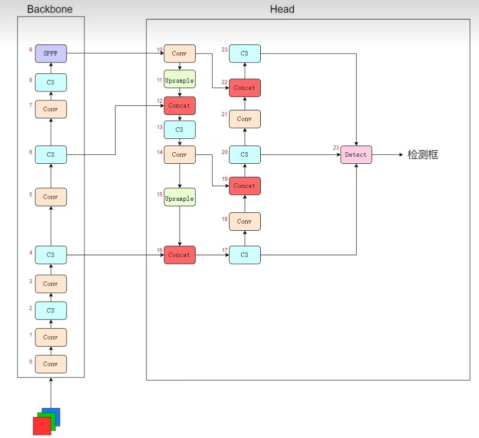

# YOLOv5火焰检测

# 变化阶段

v1-v5的变化：

yolo相关面试回答：https://blog.csdn.net/sazass/article/details/126990964

面试系列总结：https://blog.csdn.net/qq_45445740/article/details/120265713

YOLOv5是一种单阶段目标检测算法

目标检测总结：https://zhuanlan.zhihu.com/p/619025023

# 数据集相关

## 1 数据集收集

- 各个大学计算机视觉实验室的官方网站
- Github
- 网络爬虫

https://sjcj.nuaa.edu.cn/sjcjycl/article/html/202001003

## 2 数据集标准

- 每个类的图像。>= 1500 张图片。
- 每个类的实例。≥ 建议每个类10000个实例（标记对象）
- 图片形象多样。必须代表已部署的环境。对于现实世界的使用案例，我们推荐来自一天中不同时间、不同季节、不同天气、不同照明、不同角度、不同来源（在线采集、本地采集、不同摄像机）等的图像。
- 标签一致性。必须标记所有图像中所有类的所有实例。部分标记将不起作用。
- 标签准确性。
- 标签必须紧密地包围每个对象。对象与其边界框之间不应存在任何空间。任何对象都不应缺少标签。
- 标签验证。查看train_batch*.jpg 在 训练开始验证标签是否正确
- 背景图像。背景图像是没有添加到数据集以减少 False Positives（FP）的对象的图像。我们建议使用大约0-10%的背景图像来帮助减少FPs（COCO有1000个背景图像供参考，占总数的1%）。背景图像不需要标签。

300轮，22张验证图片，有多张图片重复，效果较好。

# 网络结构

> https://blog.csdn.net/weixin_43427721/article/details/123613944

yaml文件中的网络组件不需要进行叠加，只需要在配置文件中设置number即可。

CBS模块其实没什么好稀奇的，就是Conv+BatchNorm（归一化）+SiLU（用sigmoid激活）

## CSP

**CSP即backbone中的C3，因为在backbone中C3存在shortcut，而在neck中C3不使用shortcut，所以backbone中的C3层使用CSP1_x表示，neck中的C3使用CSP2_x表示。**

为了能让深层次的网络模型达到更好的训练效果，残差网络中提出的残差映射替换了以往的基础映射。对于输入x，期望输出H(x)，网络利用恒等映射将x作为初始结果，将原来的映射关系变成F(x)+x。与其让多层卷积去近似估计H(x) ，不如近似估计H(x)-x，即近似估计残差F(x)。因此，ResNet相当于将学习目标改变为目标值H(x)和x的差值，后面的训练目标就是要将残差结果逼近于0。
残差模块有什么好处呢？

> 1.梯度弥散方面。加入ResNet中的shortcut结构之后，在反传时，每两个block之间不仅传递了梯度，还加上了求导之前的梯度，这相当于把每一个block中向前传递的梯度人为加大了，也就会减小梯度弥散的可能性。
> 2.特征冗余方面。正向卷积时，对每一层做卷积其实只提取了图像的一部分信息，这样一来，越到深层，原始图像信息的丢失越严重，而仅仅是对原始图像中的一小部分特征做提取。这显然会发生类似欠拟合的现象。加入shortcut结构，相当于在每个block中又加入了上一层图像的全部信息，一定程度上保留了更多的原始信息。

**在resnet中，人们可以使用带有shortcut的残差模块搭建几百层甚至上千层的网络，而浅层的残差模块被命名为Basicblock（18、34），深层网络所使用的的残差模块，就被命名为了Bottleneck（50+）。**

## SPPF

这一模块的主要作用是对高层特征进行提取并融合，在融合的过程中作者多次运用最大池化，尽可能多的去提取高层次的语义特征。

## Neck

https://blog.csdn.net/weixin_43427721/article/details/123653669

Neck的网络结构设计也是沿用了**FPN+PAN的结构**

FPN就是使用一种 自顶向下的侧边连接在所有尺度上构建出高级语义特征图，构造了特征金字塔的经典结构。

PAN的结构也不稀奇，FPN中间经过多层的网络后，底层的目标信息已经非常模糊了，因此PAN又加入了自底向上的路线，弥补并加强了定位信息，也就是上图中的b。

# 相关技术

## 1 Mosaic数据增强

Mosaic数据增强技术采用了四张图片的随机缩放、随机剪裁、随机排布的方式对数据进行拼接，相比CutMix数据增强多用了两张图片。在目标识别过程中，要识别的目标有大目标、中等目标、小目标，并且三种目标的占比例不均衡，其中，小目标的数量是最多的，但是出现的频率很低，这种情况就会导致在bp时对小目标的优化不足，模型正确识别小目标的难度比识别中、大目标的难度要大很多，于是对于小目标来说很容易出现误检和漏检的情况。Mosaic数据增强技术做出改进后，上述的问题得到有效的解决。

- 丰富了数据集，采用“三个随机”的方式对数据进行拼接丰富了检测的数据集，尤其是随机缩放增加了很多小目标，克服了小目标的不足，让网络的鲁棒性得到提高；
- 减少GPU的使用，在Mosaic增强训练时，四张图片拼接在一起，GPU可以直接计算四张图片的数据，让Mini-batch的大小减少了很多，这使得一个GPU就可以达到比较可观的效果。

## 2 自适应anchor

一开始会先计算Best Possible Recall (BPR)

再在kmean_anchors函数中进行k 均值和遗传学习算法更新anchors。

自适应anchor是check＿anchors函数通过遗传算法与Kmeans迭代算出的最大可能召回率的anchor组合。在网络模型的训练过程中，网络在初始化的锚框的基础上输出预测框，然后与真实框groundtruth进行对比，计算两个框之间的差值，再根据差值进行反向更新，迭代网络参数，最后求出最佳的锚框值。自适应的anchor能够更好地配合网络训练，提高模型的精度，减少对anchor的设计难度，具有很好的实用性。

## 3 自适应图片缩放

- 图片预处理

- 如果是简单的使用resize，很有可能就造成了图片信息的丢失
- 在图片比例一致的情况下（长宽的收缩比例应该采用相同的比例），像素填充，保证长宽均被32整除

为了提高模型的推理速度，YOLOv5提出自适应图片缩放，根据长宽比对图像进行缩放，并添加最少的黑边，减少计算量。

该方法是用缩放后的长边减去短边再对32进行取余运算，求出padding。

在训练时并没有采用缩减黑边的方法，该方法只是在测试模型推理的时候才使用，这样提高了目标检测的准确率和速度。

## 4 Focus结构

该结构采用切片操作，将特征切成四份，每一份将当成下采样的特征，然后在channel维度进行concat。例如：原始608*608*3的数据图片，经过切片操作先变成304*304*12的特征图，再经过一次32个卷积核的卷积操作，变成304*304*32的特征图。

## 5 CSP结构

YOLOv5中的CSP[5]结构应用于两处，一处是CSP1＿X结构应用于Backbone的主干网络中，另一处的CSP2＿X结构应用于Neck中，用于加强网络的特征融合的能力。CSPNet主要从网络结构设计的角度解决推理中从计算量很大的问题。该结构的优点有：1)增强CNN的学习能力，使得模型在轻量化的同时保持较高的准确性；2)减低计算的瓶颈问题；3)减低内存的分险。

## 6 FPN+PAN结构

FPN：

- 顶层特征上采样后和底层特征融合，每层独立预测。

这个结构是FPN和PAN的联合。FPN是自顶向下的，将高层的特征信息通过上采样的方式进行传递融合，得到进行预测的特征图，而PAN正好与FPN的方向是相反的方向，它是自底向上地采取特征信息。两个结构各自从不同的主干层对不同的检测层进行参数聚合。两个结构的强强联合让得到的特征图的特征更加明显和清楚。

## 7 Bounding box的损失函数

默认使用的是CIoU，不是GIoU，不是DIoU，是CIoU

Bounding box损失函数增加了相交尺度的衡量方式，有效缓解了当两个框不相交和两个框大小完全相同的两种特殊情况。因为当预测框和目标框不相交时，IOU=0，无法反应两个框距离的远近的时候，此时的损失函数不可导；两个框大小完全相同，两个IOU也相同，IOU＿LOSS无法区分以上两种特殊情况。

## 8 nms非极大值抑制

>  后处理技术

Non-Maximum Suppression

在目标检测过程的后续处理中，对于大量的目标框的筛选问题，通常会进行nms操作，以此来达到一个不错的效果。YO⁃LOv5算法同样采用了加权的nms操作。

步骤：对所有检测框（bounding box）按置信度分数从大到小排序，第一个框作为起始框，剩下的框判断与第一个框是否相交，计算交并比（IoU），大于0.5删去，小于的不删

# 损失函数

损失函数计算原理：https://zhuanlan.zhihu.com/p/458597638

分为矩形框损失(lossrect)、置信度损失（lossobj）、分类损失(lossclc)

因此yolov5网络的损失函数定义为：

Loss=a\*lossobj+ b\*lossrect+ c\*lossclc

> 也即总体损失为三个损失的加权和，通常置信度损失取最大权重，矩形框损失和分类损失的权重次之
>
> yolov5使用**CIOU loss**计算矩形框损失，置信度损失与分类损失都用**BCE loss**计算

$$
IoU = \frac{A \cap B}{A \cup B} = \frac{S_1}{S_2} \\
IoU \ Loss = 1 - IoU
$$

$$
GIoU = IoU - \frac{S_3 - S_2}{S_3} \\
GIoU \ Loss = 1 - GIoU
$$

> $S_3$ ：包围两个矩形框的最小矩形的面积， $S_2$ ：矩形相并的面积，$S_1$：面积交 
>
> 当两个矩形框完全没有重叠区域时，无论它们距离多远，它们的IOU都为0。这种情况下梯度也为0，导致无法优化。为了解决这个问题，GIOU又被提了出来。

$$
DIoU = IoU - \frac{\rho ^ 2}{c ^ 2} \\
\rho:矩形框A,B中心点的距离;c:最小外接矩形对角线的长度 \\
DIoU Loss = 1 - DIoU
$$

> GIOU虽然把IOU的问题解决了，但它还是基于面积的度量，并没有把两个矩形框A、B的距离考虑进去。
>
> DIOU把矩形框A、B的中心点距离ρ、外接矩形框（包围两个矩形框的最小矩形）的对角线长度c都直接考虑进去

$$
CIoU = IoU - \frac{\rho ^ 2}{c ^ 2} - \alpha v = DIoU - \alpha v \\
v = \frac{4}{\pi ^ 2} \Big( \mathop{arctan} \frac{w_{gt}}{h_{gt}} - \mathop{arctan} \frac{w_p}{h_p} \Big) \\
CIoU Loss = 1 - CIoU
$$

> DIOU把两个矩形框A、B的重叠面积、中心点距离都考虑了进去，但并未考虑A、B的宽高比。
>
> ρ为框A和框B的中心点距离，c为框A和框B的最小包围矩形的对角线长度，v为框A、框B的宽高比相似度，α为v的影响因子
>
> $w_l, h_l$ 标注框的宽和高，$w_p, h_p$预测框的宽和高

$$
BCE \ Loss =
$$

**对mask为true的位置不直接赋1，而是计算对应预测框与目标框的CIOU，使用CIOU作为该预测框的置信度标签，当然对mask为false的位置还是直接赋0**。

# 评估指标

> 参考：https://zhuanlan.zhihu.com/p/619025023

1. 准确率（Accuracy）：指模型正确识别目标的比例。
2. 精度（Precision）：指模型预测为目标的样本中真正是目标的比例。
3. 召回率（Recall）：指模型检测出的目标的样本中真正是目标的比例。
4. F1值（F1-Score）：综合考虑精度和召回率的指标，用于从综合的角度评价模型的性能。
5. 平均精度均值（mAP）：是评估目标检测模型性能的一种重要指标，主要基于目标检测中每个类别的精度-召回曲线来计算。mAP越高，代表模型越准确。如COCO数据集中的mAP，PASCAL VOC中的mAP等。
6. IoU（Intersection over Union）：是指检测框与真实框之间的相交面积占两者并集面积的比例，通常用于度量目标检测算法中物体定位准确性。当IoU值越高时，检测结果越准确

$$
ACC = \frac{TP + TN}{N_P + N_N}\\
P = \frac{TP}{TP + FP} \\
R = \frac{TP}{TP + FN} \\
F1\_Score = 2 \times \frac{P \times R}{P + R} \\
AP = \int_0^1 P(R) dR \\
mAP = \frac{1}{n} \sum \limits_{i = 1}^{n} \int_0^1 P(R)dR
$$

# 缺陷

- 图片或视频像素太低导致识别误差，有些火焰无法识别出来。（数据基本上都是高像素的图片）
- 训练集较少，只有500张左右，验证集较少，只有35张
- 训练集重复数据，同类数据较多
- 大目标有时难以全部识别，可能会识别部分
- 小目标有时无法检测，可能目标非常小，难以检测到
- 正负样本数量不均衡，或者负样本数量较少
- 在自然场景下，天梯情况，光照强度，背景干扰等因素影响火焰识别的准确性

# 相关面试题

## 1 目标检测两阶段和一阶段的核心区别

目标检测技术从阶段上分为两种，一阶段和二阶段。二阶段的核心思想是首先提出proposal框，通过第一阶段的网络回归出目标框的大概位置、大小及是前景的概率，第二阶段是通过另一个网络回归出目标框的位置、大小及类别；而一阶段网络的核心是，对于输入图像，通过网络直接回归出目标大小、位置和类别。

## 2 YOLOv5检测过程

- **首先**判断每个预测框的预测置信度是否超过设定阈值，若超过则认为该预测框内存在目标，从而得到目标的大致位置。
- **接着**根据非极大值抑制算法对存在目标的预测框进行筛选，剔除对应同一目标的重复矩形框
- **最后**根据筛选后预测框的分类概率，取最大概率对应的索引，即为目标的分类索引号，从而得到目标的类别。

## 3 项目的创新点是什么

1. 数据集正负样本不均衡，负样本较少

数据集采用大量不存在目标的背景图、易混疑似火焰，如朝霞，夕阳，室内灯光，车灯等，提高模型的泛化性能

2. 数据集场景涵盖丰富，质量较高

数据集涵盖室内室外，白天黑夜，森林，工厂，房屋，公路，山地等不同场景

3. 数据集数量太少

采用数据增强技术Mosaic：将4张图片或9张图片拼接起来，相当于训练了4张或9张小图，克服了小目标识别较难的问题。

对图片进行仿射变换：随机旋转，平移，缩放，错切

随机水平翻转

# 相关参考

- 基于YOLOv5的行人车辆检测论文解读：

https://qianxu.run/2021/07/02/YOLO-paper/

- YOLOv5上融合多特征的实时火焰检测方法

http://manu46.magtech.com.cn/Jweb_prai/CN/abstract/abstract12396.shtml
